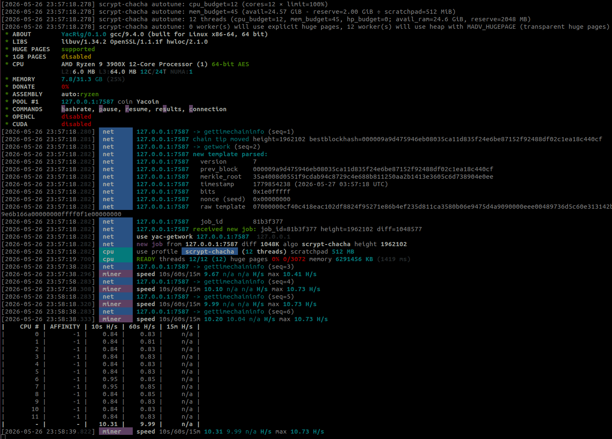

# YAC CPU mining with YACRig

This document is the single user-facing reference for mining [Yacoin](https://github.com/yacoin/yacoin) (YAC) on a CPU with YACRig. It covers building the miner, connecting it to a `yacoind` instance, tuning it for your hardware, and interpreting its output.

For the absolute minimum "first run" walkthrough, see the **Quick start** section in [`README.md`](../README.md). The rest of this document expands on the same material with the full picture.

## Table of contents

- [1. What this document covers](#1-what-this-document-covers)
- [2. Building YACRig](#2-building-yacrig)
  - [2.1 Linux prerequisites](#21-linux-prerequisites)
  - [2.2 Build commands](#22-build-commands)
  - [2.3 Verifying the build](#23-verifying-the-build)
- [3. Connecting YACRig to yacoind](#3-connecting-yacrig-to-yacoind)
  - [3.1 yacoind side: minimum required configuration](#31-yacoind-side-minimum-required-configuration)
  - [3.2 YACRig side: commandline options and JSON config](#32-yacrig-side-commandline-options-and-json-config)
  - [3.3 Confirming the connection works](#33-confirming-the-connection-works)
  - [3.4 Interactive runtime commands](#34-interactive-runtime-commands)
- [4. Tuning for maximum hashrate](#4-tuning-for-maximum-hashrate)
  - [4.1 The autotuner](#41-the-autotuner)
  - [4.2 Memory: scratchpad size and RAM budget](#42-memory-scratchpad-size-and-ram-budget)
  - [4.3 Overriding the autotuner](#43-overriding-the-autotuner)
  - [4.4 CPU affinity and priority](#44-cpu-affinity-and-priority)
  - [4.5 Donation level (informational)](#45-donation-level-informational)
- [5. Measured hashrate on tested CPUs](#5-measured-hashrate-on-tested-cpus)
  - [5.1 AMD Ryzen 9 3900X](#51-amd-ryzen-9-3900x)
  - [5.2 12th Gen Intel Core i5-12500H](#52-12th-gen-intel-core-i5-12500h)
- [6. Reading the log output](#6-reading-the-log-output)
- [7. Troubleshooting](#7-troubleshooting)
- [8. Reference: all useful YACRig commandline options, by category](#8-reference-all-useful-yacrig-commandline-options-by-category)

---

## 1. What this document covers

**What this document covers**

Everything a user needs to mine YAC on a CPU end-to-end:

- Compiling YACRig from source on Linux.
- Pointing it at a `yacoind` instance you control.
- Choosing thread count and memory reserve to get the best hashrate your hardware can produce.
- Interpreting the log output and diagnosing the most common problems.

**Current capabilities and limitations**

- **Solo mining via `getwork`** is supported. YACRig talks directly to a local `yacoind` you control over HTTP JSON-RPC.
- **Solo mining via `getblocktemplate`** (the newer BIP 22/23 daemon RPC) is **not supported yet** and is planned for a future release.
- **Pool mining via Stratum** is **not supported yet** and is planned for a future release.
- **GPU mining (NVIDIA / AMD)** is **not supported yet** for YAC and is planned for a future release.

**Not covered**

- The protocol-level design of YAC's scrypt-chacha proof-of-work.
- The internal architecture of YACRig's worker threads.
- Anything specific to setting up `yacoind` itself beyond the few RPC-related lines YACRig needs. For yacoind's own configuration, build process, and consensus rules, see the [Yacoin repository](https://github.com/yacoin/yacoin).

---

## 2. Building YACRig

### 2.1 Linux prerequisites

YACRig is tested on Ubuntu 20.04 / 22.04 with the following packages installed:

```bash
sudo apt-get install -y \
    build-essential cmake git automake libtool autoconf pkg-config \
    libuv1-dev libssl-dev libhwloc-dev
```

The build also works on other Linux distributions with equivalent packages. The names above are the Debian/Ubuntu ones. You need a C++17-capable compiler (gcc 9+ or clang 10+ both work).

### 2.2 Build commands

From the repository root:

```bash
cmake -S . -B build \
      -DWITH_SCRYPT_CHACHA=ON \
      -DWITH_HTTP=ON
cd build
make -j$(nproc)
```

What the two CMake build flags do:

| CMake flag | Default | Why YACRig needs it |
|------------|---------|---------------------|
| `WITH_SCRYPT_CHACHA=ON` | ON | Compiles the scrypt-chacha kernel and the YAC-specific `YacGetworkClient`. Without it, `--coin=yac` is rejected at config-load time. |
| `WITH_HTTP=ON` | ON | Enables the HTTP client used to talk to yacoind over JSON-RPC. Without it, the `--daemon` mode cannot connect. |

Both are on by default. You only need to set them explicitly if you previously turned them off.

If you previously built without `WITH_SCRYPT_CHACHA`, do a `make clean` first so the linker actually picks up the new objects.

### 2.3 Verifying the build

A successful build leaves a `yacrig` binary inside `build/`. Verify it with the built-in self-test:

```bash
./yacrig --scrypt-chacha-test
```

Expected output:

```
vector 1: OK
vector 2: OK
scrypt-chacha-test: all 2 vector(s) passed
```

The test mines two known YAC block headers against their published scrypt-chacha hashes. It runs the **same kernel YACRig uses at mining time** (including any AVX2 / AVX / SSSE3 dispatch decisions made at runtime), allocates a real 512 MiB scratchpad, and exits with code 0 on success or 1 on failure.

The test takes a few seconds on a modern CPU (one scrypt-chacha hash per vector, ~1-4 seconds each).

Run this on any new machine before trusting hashrate numbers. If both vectors pass, the kernel is producing the same bytes the YAC network expects. Any "rejected share" issues are then network- or daemon-side, not kernel-side.

---

## 3. Connecting YACRig to yacoind

YACRig currently supports **solo mining via the `getwork` JSON-RPC protocol only**. It talks directly to a `yacoind` instance over HTTP JSON-RPC and submits found blocks back to that same daemon. There is no pool, no Stratum, and no shared-work coordination: you mine for the address(es) the daemon's wallet controls. The newer **`getblocktemplate`** solo-mining RPC and **Stratum** pool mining will both be supported in a future release.

The connection has two ends to configure: `yacoind` must accept the RPC calls, and YACRig must know where to send them.

### 3.1 yacoind side: minimum required configuration

The relevant lines in your `yacoin.conf`:

```ini
# JSON-RPC server
server=1                       # enables the RPC server (REQUIRED)
rpcuser=yacuser                # pick a username
rpcpassword=yacpass            # pick a strong password
rpcport=7687                   # any free port, 7687 is yacoind's default
rpcallowip=127.0.0.1           # only accept RPC from localhost

# Mining-related
gen=0                          # turn OFF yacoind's built-in miner
listen=1                       # accept incoming P2P (so you can have peers)
```

Three things to know:

1. **At least one peer is required**: yacoind's `getwork` RPC pre-flight check refuses to hand out work if `getconnectioncount == 0`. On a fresh installation with no outbound peers, the simplest fix is to add a trusted peer line (`addnode=<host>:<p2p-port>`) or run a second local node and point them at each other.
2. **The wallet must be unlocked**: If you've encrypted your wallet with `walletpassphrase`-style locking, YACRig's submissions will be rejected with `Unable to sign block, wallet locked?`. Either start the daemon without encryption or unlock it before mining.
3. **The daemon must be out of initial-block-download (IBD)**: If yacoind is still catching up to the chain tip, `getwork` returns `Yacoin is downloading blocks...` and YACRig will retry until IBD completes.

### 3.2 YACRig side: commandline options and JSON config

With `yacoind` configured per [§3.1](#31-yacoind-side-minimum-required-configuration), the four invocations below build up from minimal to fully-configured. Pick the one that fits your needs:

```bash
# 1. The basic command to run
./yacrig --coin=yac --daemon -o <host>:<rpcport> -u <rpcuser> -p <rpcpassword>

# 2. Specify the interval for polling yacoind for new mining jobs
./yacrig --coin=yac --daemon -o <host>:<rpcport> -u <rpcuser> -p <rpcpassword> \
         --daemon-poll-interval=<interval>

# 3. Display more helpful logs
./yacrig --coin=yac --daemon -o <host>:<rpcport> -u <rpcuser> -p <rpcpassword> \
         --daemon-poll-interval=<interval> --print-time=<seconds> --verbose

# 4. Specify the number of CPU threads
./yacrig --coin=yac --daemon -o <host>:<rpcport> -u <rpcuser> -p <rpcpassword> \
         --threads=<number_threads> --daemon-poll-interval=<interval> \
         --print-time=<seconds> --verbose
```

**Commands 1-3 do not set `--threads` and therefore let YACRig's autotuner pick the worker count automatically**, based on the number of physical CPU cores and the amount of free RAM on the machine (each scrypt-chacha worker reserves a 512 MiB scratchpad). Only command 4 overrides that with an explicit thread count.

#### Commandline options used above

| Option | Default | Description |
|--------|---------|-------------|
| `--coin=yac` | - | Selects the YAC preset (algorithm = scrypt-chacha, target = 60-second block time). **Required** for YAC mining. The combination `--coin=yac --daemon` is what routes the connection through `YacGetworkClient` rather than the generic daemon client. |
| `--daemon` | off | Talks to a daemon over HTTP JSON-RPC instead of a Stratum pool. **Required** for solo YAC mining. |
| `-o <host>:<rpcport>` | - | yacoind's RPC endpoint. Matches `rpcport` in `yacoin.conf`. The default RPC port is `7687`. **Required.** |
| `-u <rpcuser>` | - | Matches yacoind's `rpcuser`. Packed into the HTTP `Authorization: Basic …` header. **Required.** |
| `-p <rpcpassword>` | - | Matches yacoind's `rpcpassword`. **Required.** |
| `--daemon-poll-interval=<ms>` | `10000` (ms) | How often YACRig polls yacoind for a new chain tip. The default of 10 s keeps log noise down with no measurable hashrate impact. Lower it (e.g. `1000`) if you need faster chain-tip detection. |
| `--print-time=<seconds>` | `60` (s) | How often the rolling-average hashrate line is printed to the log. |
| `--verbose` | off | Print one line per RPC call and one line per share found. Recommended while you're learning the tool or diagnosing problems. |
| `--threads=<number_threads>` | autotuned | Force exactly this many CPU worker threads. When omitted, the autotuner picks `min(cpu_budget, mem_budget)` (see [§4.1](#41-the-autotuner)). |
| `--reserve-ram=<MiB>` | `2048` (MiB) | RAM in megabytes the autotuner leaves untouched for the OS and other processes. Lower this to fit more workers on a memory-tight machine. Raise it when YACRig competes with other workloads. **Has no effect when `--threads` is also set** (see [§4.2](#42-memory-scratchpad-size-and-ram-budget)). |

####  A concrete example using all of the options above

Local `yacoind` on the default RPC port `7687`, polling every 30 s, printing the hashrate every 30 s, and running 4 worker threads:

```bash
./yacrig --coin=yac --daemon \
         -o 127.0.0.1:7687 \
         -u yacuser -p yacpass \
         --threads=4 \
         --daemon-poll-interval=30000 \
         --print-time=30 \
         --verbose
```

`--reserve-ram` is intentionally omitted: when `--threads` is set the autotuner doesn't run, so `--reserve-ram` would be silently ignored. If you'd rather let the autotuner pick the thread count and tune the OS reserve, drop `--threads=4` and add `--reserve-ram=<MiB>` instead.

The commands above cover only the most common options. YACRig accepts many more: logging, CPU affinity, scheduler priority, JSON-config-file loading, etc. The full list, grouped by purpose, lives in [§8 Reference: all useful YACRig commandline options, by category](#8-reference-all-useful-yacrig-commandline-options-by-category). Reach for that section when you need anything beyond the basics.

#### Using a JSON config file

For anything beyond a one-line invocation, putting the settings in a JSON config file is more convenient than typing them on every restart. The minimum settings from the concrete example above, expressed as `config.json`:

```json
{
    "cpu": {
        "enabled": true,
        "reserve-ram": 1024
    },
    "pools": [
        {
            "url": "127.0.0.1:7687",
            "user": "yacuser",
            "pass": "yacpass",
            "coin": "yac",
            "daemon": true,
            "daemon-poll-interval": 30000
        }
    ],
    "print-time": 30,
    "verbose": 1
}
```

Run YACRig with the config file:

```bash
./yacrig --config=config.json
```

You can also **combine** a JSON config file with commandline options. Commandline options override the corresponding JSON values. For example, to use the config above but force 8 worker threads:

```bash
./yacrig --config=config.json --threads=8
```

Two notes on JSON config files:

- The `pools` field is an array, so you can list multiple endpoints. YACRig will iterate through them on failure (failover). Each entry needs the same `coin: "yac"` and `daemon: true` keys to be treated as a YAC daemon endpoint.
- Every option in [§8](#8-reference-all-useful-yacrig-commandline-options-by-category) maps to a JSON key. The commandline name and JSON key usually match (e.g. `--daemon-poll-interval` ↔ `"daemon-poll-interval"`). The CPU-related options live under the `"cpu"` object.

### 3.3 Confirming the connection works

A healthy startup with `--verbose` looks roughly like:

```
 * ABOUT        YACRig/0.1.0 gcc/9.4.0 (built for Linux x86-64, 64 bit)
 * CPU          12th Gen Intel(R) Core(TM) i5-12500H ...
 * MEMORY       8.2/15.2 GB (53%)
 * DONATE       0%
 * POOL #1      127.0.0.1:7687 coin Yacoin
 * COMMANDS     hashrate, pause, resume, results, connection
[…]  net      127.0.0.1:7687 → gettimechaininfo (seq=1)
[…]  net      127.0.0.1:7687 chain tip moved height=N bestblockhash=…
[…]  net      127.0.0.1:7687 → getwork (seq=2)
[…]  net      127.0.0.1:7687 new template parsed: …
[…]  net      use yac-getwork 127.0.0.1:7687  …
[…]  net      new job from 127.0.0.1:7687 diff … algo scrypt-chacha
[…]  cpu      use profile  scrypt-chacha  (N threads) scratchpad 512 MB
[…]  cpu      READY threads N/N (N) memory … KB
[…]  miner    speed 10s/60s/15m … H/s max … H/s
[…]  cpu      accepted (1/0) diff … (… ms)
```

The two log lines that confirm everything is wired correctly:

- `use yac-getwork …`: YACRig successfully chose the YAC client and got a first response from yacoind. If you don't see this within 10-20 seconds, the connection isn't working. Check yacoind side first, then YACRig's `-o` / `-u` / `-p` values.
- `accepted (N/0) diff …`: yacoind accepted a share. The number after the `/` is the *rejected* counter. In normal operation it should stay at `0`.

### 3.4 Interactive runtime commands

While YACRig is running, you can type single-character commands directly into its terminal to inspect or control it. The startup banner advertises them on the `* COMMANDS` line. They're case-insensitive.

| Key | Effect |
|-----|--------|
| `h` or `H` | **Hashrate.** Print the current rolling-average hashrate (10 s / 60 s / 15 min) for each worker and the total. Useful for a quick check without waiting for the next periodic `--print-time` report. |
| `p` or `P` | **Pause.** Stop all workers immediately. Workers are still alive (scratchpads stay allocated), but no hashes are computed and no shares are submitted. The pool stays connected so polling continues. |
| `r` or `R` | **Resume.** Re-enable workers after a `p`. Mining picks up on the next nonce from the current job. |
| `s` or `S` | **Results / share statistics.** Print the per-pool accepted/rejected share counts, the latest difficulty, average submit latency, and a list of the most recent shares' results. |
| `c` or `C` | **Connection.** Print the active pool URL, the algorithm in use, uptime since the last connect, and last-ping latency. Use this when you suspect the connection has gone stale. |
| `Ctrl+C` | **Exit.** Gracefully shut workers down, close the connection, and exit with status 0. The same effect can be triggered externally with `SIGINT` or `SIGTERM`. |

These commands are inherited from XMRig and work the same way. They do not require `--verbose` to be set.

---

## 4. Tuning for maximum hashrate

scrypt-chacha is a memory-heavy proof-of-work: each worker thread holds a 512 MiB scratchpad and spends most of its time doing random reads/writes against it. Several different hardware factors interact to determine the hashrate you can sustain:

- **Number of physical CPU cores**: each worker thread needs CPU time to issue the random scratchpad accesses, so a CPU with more cores has a higher ceiling.
- **Number of CPU threads (worker count)**: on some CPUs, configuring more threads than physical cores can squeeze out additional hashrate (the extra threads keep the memory subsystem busier while another thread is waiting on a cache miss). On other CPUs it actively hurts. There is no single right answer. You have to measure.
- **Available RAM**: each worker needs 512 MiB of scratchpad. If RAM is short, you can either reduce the number of workers or reduce `--reserve-ram` so the autotuner can fit more.
- **RAM bandwidth**: the scratchpad accesses are dominated by main-memory traffic, so a CPU with more memory channels or faster memory will scale further before saturating.

The practical implication: **don't trust any single rule of thumb.** Run YACRig with a few different `--threads` values, watch the `miner speed …` line at steady state, and pick the configuration that gives the highest sustained hashrate on your machine. Or, if you'd rather let the autotuner pick the thread count for you, specify `--reserve-ram` values instead. Note that `--threads` and `--reserve-ram` don't combine: setting `--threads` bypasses the autotuner entirely and makes `--reserve-ram` a no-op. See [§4.2](#42-memory-scratchpad-size-and-ram-budget).

The autotuner ([§4.1](#41-the-autotuner)) gives you a reasonable starting point. The next subsections explain what each lever does and how to override it.

### 4.1 The autotuner

On startup, YACRig runs a scrypt-chacha-specific autotuner that picks a sensible thread count based on:

- the number of physical cores hwloc reports,
- the `--cpu-max-threads-hint` percentage (default 100),
- available system RAM minus `--reserve-ram`.

The autotuner logs its decisions, for example:

```
scrypt-chacha autotune: cpu_budget=6 (cores=6 × limit=100%)
scrypt-chacha autotune: mem_budget=11 (avail=7.8 GiB - reserve=2.0 GiB ÷ scratchpad=512 MiB)
scrypt-chacha autotune: 6 threads (cpu_budget=6, mem_budget=11; avail_ram=7.8 GiB, reserve=2048 MB)
```

Read this as: "I would run 6 threads CPU-wise and could fit 11 scratchpads memory-wise, so I'll run `min(6, 11) = 6` threads."

The final thread count is `min(cpu_budget, mem_budget)`. If `mem_budget == 0`, the autotuner returns zero threads and YACRig logs a clear warning. You don't have enough RAM for even one worker, and the only fixes are to lower `--reserve-ram` or add RAM.

#### Why `cpu_budget` is based on physical cores, not hardware threads

Note that `cpu_budget` is computed from the number of **physical CPU cores** reported by hwloc, not the number of **hardware threads**. Modern CPUs with technologies such as Intel HyperThreading or AMD SMT expose more hardware threads than they have physical cores, typically two hardware threads per core. A 6-core CPU with HyperThreading appears to the OS as 12 logical processors, but hwloc still reports `cores = 6`, and that is the number the autotuner uses.

Sizing the worker count to *cores* rather than *hardware threads* is a deliberate trade-off:

- It leaves the second hardware thread on each core free for the operating system and other interactive tasks. The machine stays responsive. Your shell, browser, and IDE keep getting CPU time.
- It usually gives most of the achievable hashrate without saturating the CPU. The two hardware threads on a single core share the same execution units, so doubling the worker count rarely doubles throughput.

If you don't care about system responsiveness and want to squeeze out the last few percent of hashrate, override the autotuner with an explicit `--threads=<N>` greater than the physical core count (e.g. `--threads=12` on a 6-core HyperThreading CPU). On some CPUs this measurably increases hashrate. On others it doesn't or even slightly reduces it.

The autotuner is a starting point, not a final answer. See [§4.3](#43-overriding-the-autotuner) for how to override its picks once you've measured your machine's real optimum.

### 4.2 Memory: scratchpad size and RAM budget

**Per-thread cost**: Each worker thread holds one 512 MiB scratchpad for as long as it's running. With N threads, YACRig holds N × 512 MiB ≈ N/2 GiB resident. On a 16 GiB machine the practical ceiling is about 28 threads before you start pressuring the page cache (autotuner defaults reserve 2 GiB for the rest of the OS, leaving room for ~28 × 512 MiB = 14 GiB of scratchpads).

**`--reserve-ram=N` (default 2048 MiB).** How much RAM in megabytes the autotuner leaves untouched for the OS and other processes. Lower this to squeeze out more workers on a memory-tight machine. Raise it if YACRig competes with other workloads (browser, IDE, databases).

**`--reserve-ram` only takes effect when the autotuner runs.** If you also pass `--threads=N` (or set an explicit `threads` value in the JSON config), the autotuner is skipped entirely and `--reserve-ram` is silently ignored. In that case you are responsible for sizing N so that `N × 512 MiB` plus what the rest of the system needs fits in your RAM.

The same setting is available as `cpu.reserve-ram` in a JSON config file. The commandline option overrides the JSON value when both are present:

```bash
./yacrig --coin=yac --daemon -o ... --reserve-ram=1024
```

or in `config.json`:

```json
{ "cpu": { "reserve-ram": 1024 } }
```

### 4.3 Overriding the autotuner

If the autotuner's choice doesn't match your hardware after measuring:

- **Cap the thread count**: `--threads=N` forces exactly N workers and **bypasses the autotuner entirely**. Neither `--cpu-max-threads-hint` nor `--reserve-ram` has any effect once `--threads` is set. You are responsible for choosing N so that `N × 512 MiB` of scratchpad fits in your available RAM. If you ask for more workers than you have RAM for, individual workers will fail to allocate their scratchpad at startup.
- **Scale by percentage**: `--cpu-max-threads-hint=N` (default 100) tells the autotuner to use `cores × N/100` for the CPU budget. `--cpu-max-threads-hint=50` on a 12-core machine gives 6 threads.
- **Disable a specific set of cores**: combine `--threads=N --cpu-affinity=0xMASK` to both cap the count and bind workers to specific cores. The mask is a bitmask: `0xFF` = cores 0-7, `0xAA` = cores 1,3,5,7.

The autotuner runs once at startup. There is no runtime reconfiguration: change the options and restart.

### 4.4 CPU affinity and priority

- `--cpu-affinity=0xMASK`: pin worker threads to specific cores. On a machine you also use interactively, leaving the first one or two cores free (e.g. `0xFC` to skip cores 0-1 on an 8-core box) keeps the system responsive.
- `--cpu-priority=N`: process scheduler priority, from `0` (lowest) to `5` (highest). Concretely:
    - `0` = **idle / lowest priority.** The OS preempts mining whenever any other process needs CPU time, so interactive tasks (shell, browser, IDE) get the CPU first and mining only consumes whatever is left over. On Linux this maps to `nice 19` plus the `SCHED_IDLE` scheduler class (or `SCHED_BATCH` if `SCHED_IDLE` is unavailable). Useful for background mining on a desktop you also use.
    - `2` = **normal priority.** Mining competes with other user processes on equal terms (`nice 0`). This is the default if `--cpu-priority` is omitted.
    - `5` = **highest priority.** Mining gets CPU time ahead of most user processes (`nice -15`). Use only on a dedicated mining machine. At this level, mining can starve interactive tasks and degrade system responsiveness.

### 4.5 Donation level (informational)

The upstream XMRig codebase includes an opt-in dev-donation feature that diverts a small fraction of hashes to a developer pool. YACRig **forces this off for any pool configured with `coin = yac`**, regardless of what `--donate-level` you pass on the commandline or what your JSON config says. The reason is purely practical: the dev donation pool speaks Stratum for the original XMRig algorithms and would simply reject YAC `getwork` shares.

The startup banner will always show `DONATE 0%` when a YAC pool is configured.

---

## 5. Measured hashrate on tested CPUs

This section collects scrypt-chacha hashrate numbers from real YACRig runs on different CPU models. Two uses:

- **Set expectations** before you start mining on a given CPU. If you know what hashrate someone else got on the same chip, you'll spot it immediately when your own run is well below that.
- **Compare configurations.** Each subsection shows several `--threads` values for the same CPU, so you can read off how thread count scales (or doesn't) on that hardware.

The numbers are the steady-state hashrate read from the `miner speed 60s` column after a few minutes of mining. To add a new CPU model, append a new subsection below with its own table. Within a table, order rows by ascending `--threads` value, with the autotuner default as the first row.

### 5.1 AMD Ryzen 9 3900X

12 cores / 24 hardware threads.

| `--threads` value | Worker count | Scratchpad RAM used | Hashrate (H/s) | Notes |
|-------------|--------------|---------------------|----------------|-------|
| autotuned | 12 | 12 × 512 MiB = 6 GiB | 10.0 | Autotuner default (one worker per physical core). |
| 18 | 18 | 18 × 512 MiB = 9 GiB | 12.5 | Past the core count, extra workers start running on each core's second SMT hardware thread. While one worker on the core is stalled waiting for scratchpad memory, the other can use the core's execution units, so hashrate keeps increasing. |
| 24 | 24 | 24 × 512 MiB = 12 GiB | 14.4 | Matches the hardware-thread count. Practical sweet spot for this CPU. |
| 30 | 30 | 30 × 512 MiB = 15 GiB | 14.4 | No gain over `--threads=24`. The CPU has no further execution resources to give, so the extra 3 GiB of scratchpad RAM is wasted. |

### 5.2 12th Gen Intel Core i5-12500H

12 cores / 16 hardware threads (hybrid: 4 P-cores with Hyper-threading + 8 E-cores).

| `--threads` value | Worker count | Scratchpad RAM used | Hashrate (H/s) | Notes |
|-------------|--------------|---------------------|----------------|-------|
| autotuned | 12 | 12 × 512 MiB = 6 GiB | 7.3 | Autotuner default (one worker per physical core). |
| 8 | 8 | 8 × 512 MiB = 4 GiB | 5.7 | Below the physical-core count, so several cores sit idle and hashrate drops. |
| 16 | 16 | 16 × 512 MiB = 8 GiB | 7.9 | Matches the hardware-thread count. Practical sweet spot for this CPU, with a modest gain over the autotuner. |
| 20 | 20 | 20 × 512 MiB = 10 GiB | 7.9 | No gain over `--threads=16`. The CPU has no further execution resources to give, so the extra 2 GiB of scratchpad RAM is wasted. |

---

## 6. Reading the log output

A `--verbose` log mixes lines from several layers. The screenshot below shows real log output captured while running yacrig with the autotuner automatically selecting the number of threads:



Knowing which lines mean what makes diagnosing easier:

| Log line | Means | Look at this when |
|---|---|---|
| `scrypt-chacha autotune: …` | Thread/memory budget chosen at startup. | You want to know why YACRig picked N threads. |
| `use profile  *  (N threads) scratchpad 512 MB` | The CPU backend started N workers with 512 MiB of scratchpad each. | Confirming the autotuner's decision actually took effect. |
| `READY threads N/N (N) memory … KB` | All N workers allocated their scratchpads. | Confirming workers are up and running. |
| `→ gettimechaininfo (seq=N)` | YACRig sent the cheap chain-tip probe. | Verifying the polling loop is alive. Should fire every `--daemon-poll-interval` ms. |
| `→ getwork (seq=N)` | YACRig fetched a new work template. | A fresh job is being parsed. Fires after each chain-tip change and after each accepted share. |
| `chain tip moved height=N bestblockhash=…` | The cheap probe noticed a new block. | Useful for confirming that *someone* mined a block (you or another peer). |
| `new job from … diff D algo scrypt-chacha` | The new template was parsed and pushed to workers. | After a `getwork`, workers should always pick up a new job. |
| `miner speed 10s/60s/15m a b c H/s` | Rolling-average hashrate over 10 seconds / 1 minute / 15 minutes. | Watching steady-state performance. |
| `cpu accepted (N/M) diff D (… ms)` | yacoind accepted share #N. `M` is the rejected count. | Should fire roughly once per `mean-time-per-share`, where the mean depends on your hashrate and the chain difficulty. |
| `cpu rejected (N/M) diff D "reason"` | yacoind rejected share #N with the given reason. | Always investigate. "Stale or invalid share" usually means the chain advanced between the time you started this hash and the time you submitted. Small numbers are normal at low difficulty, large numbers suggest a problem. |
| `connect error: "connection refused"` | The HTTP connection to yacoind failed. | yacoind is down, listening on a different port, or `rpcallowip` is blocking you. |
| `no active pools, stop mining` | All configured pools have failed. Workers are paused. | YACRig will keep retrying every 5 seconds. If yacoind comes back, mining resumes automatically. |

One useful debugging reflex: if you suspect YACRig is stuck, look for **`→ gettimechaininfo` lines continuing at the configured cadence**. As long as they're being printed, the network layer is alive and retrying. The problem is on the daemon side. If those lines stop, something inside YACRig has gone wrong.

---

## 7. Troubleshooting

### "scrypt-chacha: only X GiB available, need >Y GiB for one thread"

The autotuner found less than 512 MiB + `--reserve-ram` of available memory and returned zero threads. Either:

- lower `--reserve-ram` (default 2048 MiB, can drop to 512 if you trust nothing else on the machine will need much RAM),
- close other memory-hungry programs,
- or use a machine with more RAM (the minimum to mine even one thread is roughly 2.5 GiB free + whatever your OS needs).

### "connect error: connection refused" repeating

yacoind isn't accepting connections at the address/port YACRig is using. Check, in order:

1. `yacoind` is actually running (`ps aux | grep yacoind`).
2. `server=1` is in `yacoin.conf` (without it the RPC server isn't started).
3. The `rpcport` in `yacoin.conf` matches the port in YACRig's `-o` value.
4. `rpcallowip` allows YACRig's host. For local YACRig + local yacoind this should be `127.0.0.1`.
5. No firewall is blocking the port (`sudo iptables -L` / `sudo nft list ruleset`).

### "Yacoin is not connected!" returned by getwork

yacoind has no peers. `getwork` requires at least one to avoid mining a forked chain. Fixes:

- add an `addnode=<host>:<p2p-port>` line to `yacoin.conf` pointing at any known peer (including a second local yacoind),
- check your network. The daemon needs outbound connectivity on the P2P port.

### "Yacoin is downloading blocks..."

yacoind is in initial-block-download. Wait until it finishes. `yacoin-cli getblockchaininfo` shows `verificationprogress` approaching 1.0.

### Shares always rejected as "stale or invalid"

The chain is advancing faster than your hashrate. This is normal at very low difficulty when two solutions appear close together. yacoind accepts the first and rejects the second. If you're seeing this at production difficulty, it means another miner found the block first. Your share was correct but no longer needed.

If you see rejection on a chain where you're the only miner, double-check that yacoind isn't running with a non-default `-nFactorAtHardfork` value. YACRig's kernel is fixed at the production value (21) and a daemon configured differently will compute different hashes for the same block header.

### Hashrate is much lower than expected

Hashrate depends on several interacting factors (see [§4](#4-tuning-for-maximum-hashrate)), so when it's low the only reliable approach is to test alternative configurations and compare. Things to try, roughly in order of frequency:

1. **Try a different `--threads` value.** The autotuner picks `min(cpu_budget, mem_budget)`, but the *measured* optimum for a given CPU is sometimes lower (you're hitting a memory-bandwidth ceiling) and sometimes higher (the extra threads keep the memory subsystem busier). Run for a minute or two at each value and read the steady-state `miner speed …` line.
2. **CPU thermal throttling.** Run `watch -n 1 'sensors | grep Core'` while mining. If temperatures hit 95-100 °C the CPU is throttling. Improve cooling or lower `--cpu-max-threads-hint`.
3. **Background load.** Mining on the same machine you're using interactively means workers get interrupted. `--cpu-priority=0` makes that less disruptive (at the cost of hashrate when the system is busy).
4. **Insufficient free RAM for the autotuner's chosen thread count.** Check the `scrypt-chacha autotune: mem_budget=…` line. If `mem_budget < cpu_budget`, lower `--reserve-ram` or add RAM.

### YACRig started fine but stopped polling

Look for `→ gettimechaininfo` lines in `--verbose` output. If they continued at the `--daemon-poll-interval` cadence, YACRig is healthy and trying. The daemon must have stopped responding. If they stopped, YACRig itself froze. File an issue with the last ~50 lines of `--verbose` log.

### "Unable to sign block, wallet locked?"

yacoind's wallet is encrypted and locked. Unlock it with `yacoin-cli walletpassphrase "your-passphrase" 600` before YACRig submits the next share. (The 600 is the unlock duration in seconds. Pick something longer than your expected share interval.)

---

## 8. Reference: all useful YACRig commandline options, by category

The four options listed in [§3.2](#32-yacrig-side-commandline-options-and-json-config) (`--coin=yac`, `--daemon`, `-o`, `-u`/`-p`) are the minimum needed to start mining. The tables below cover every other commandline option that's useful for a YAC `--coin=yac --daemon` setup, grouped by purpose. (YACRig inherits the full XMRig commandline option set. Anything Stratum-, OpenCL-, CUDA-, RandomX-, or KawPow-specific is omitted here because it doesn't apply to YAC.)

### Network

| Option | Default | Purpose |
|--------|---------|---------|
| `-o, --url=URL` | - | URL of mining server (yacoind RPC endpoint for solo mining). |
| `-a, --algo=ALGO` | - | Mining algorithm. For YAC use `--coin=yac` instead. |
| `--coin=COIN` | - | Specify coin instead of algorithm. Use `--coin=yac`. |
| `-u, --user=USERNAME` | - | Username for mining server (yacoind `rpcuser`). |
| `-p, --pass=PASSWORD` | - | Password for mining server (yacoind `rpcpassword`). |
| `-O, --userpass=U:P` | - | Username:password pair for mining server, alternative to `-u` / `-p`. |
| `--daemon` | off | Use daemon RPC instead of pool for solo mining. **Required** for YAC. |
| `--daemon-poll-interval=N` | 10000 | Daemon poll interval in milliseconds. The 10 s default keeps log noise down without measurable hashrate impact. Lower it (e.g. 1000) if you need faster chain-tip detection. |

### CPU backend

| Option | Default | Purpose |
|--------|---------|---------|
| `--no-cpu` | off | Disable the CPU mining backend. (YAC currently has no other backend, so this effectively disables mining.) |
| `-t, --threads=N` | autotuned | Number of CPU worker threads. Proper CPU affinity is required for some optimisations. |
| `--reserve-ram=N` | 2048 | RAM (MiB) the autotuner leaves untouched for OS and other processes. Has no effect when `--threads` is also set (autotuner is bypassed). |
| `--cpu-affinity=N` | - | Set process affinity to CPU core(s). Mask `0x3` for cores 0 and 1. |
| `--cpu-priority=N` | OS default | Set process priority: `0` idle, `2` normal up to `5` highest. |
| `--cpu-max-threads-hint=N` | 100 | Maximum CPU threads count (in percentage) hint for the autotuner. |
| `--cpu-memory-pool=N` | auto | Number of 2 MB pages for persistent memory pool: `-1` (auto), `0` (disable). |
| `--cpu-no-yield` | off | Prefer maximum hashrate over system response/stability. |

### Logging

| Option | Default | Purpose |
|--------|---------|---------|
| `-S, --syslog` | off | Use system log for output messages. |
| `-l, --log-file=FILE` | - | Log all output to a file. |
| `--print-time=N` | 60 | Print hashrate report every N seconds. |
| `--no-color` | off | Disable coloured output (useful when redirecting to a file). |
| `--verbose` | off | Verbose output: one line per RPC and one line per share found. Highly recommended while learning the tool or debugging. |

### Misc

| Option | Default | Purpose |
|--------|---------|---------|
| `-c, --config=FILE` | - | Load a JSON-format configuration file. |
| `-B, --background` | off | Run the miner in the background. |
| `-V, --version` | - | Output version information and exit. |
| `-h, --help` | - | Display this help and exit. |
| `--dry-run` | off | Test configuration and exit. |
| `--export-topology` | - | Export hwloc topology to an XML file and exit. |
| `--scrypt-chacha-test` | - | Run the golden-vector self-test ([§2.3](#23-verifying-the-build)) and exit. |
