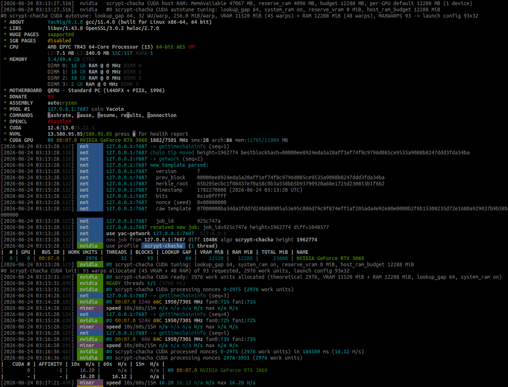

# YAC CUDA mining with YACRig (NVIDIA GPUs)

This document is the single user-facing reference for mining [Yacoin](https://github.com/yacoin/yacoin) (YAC) on an NVIDIA GPU with YACRig. It covers building the miner and its CUDA plugin, connecting to a `yacoind` instance, tuning the NVIDIA GPU for your hardware, and interpreting the output.

The title says "CUDA" rather than "GPU" deliberately: this path uses the NVIDIA CUDA toolchain only. AMD GPU support (OpenCL) is planned for a later milestone and will get its own document.

For mining on a CPU instead, see [`YAC_CPU_MINING.md`](./YAC_CPU_MINING.md). The daemon-connection, log-reading, and interactive-command material is shared between the two, so this document cross-references the CPU guide for those parts and focuses on what is specific to NVIDIA GPUs.

## Table of contents

- [1. What this document covers](#1-what-this-document-covers)
- [2. Building YACRig with CUDA support](#2-building-yacrig-with-cuda-support)
  - [2.1 The two-binary split](#21-the-two-binary-split)
  - [2.2 Prerequisites](#22-prerequisites)
  - [2.3 Building the yacrig-cuda plugin](#23-building-the-yacrig-cuda-plugin)
  - [2.4 Building YACRig](#24-building-yacrig)
  - [2.5 Verifying the build](#25-verifying-the-build)
- [3. Connecting to yacoind](#3-connecting-to-yacoind)
  - [3.1 yacoind side: minimum required configuration](#31-yacoind-side-minimum-required-configuration)
  - [3.2 The minimal NVIDIA GPU run](#32-the-minimal-nvidia-gpu-run)
  - [3.3 NVIDIA GPU-specific commandline options](#33-nvidia-gpu-specific-commandline-options)
  - [3.4 Using a JSON config file](#34-using-a-json-config-file)
  - [3.5 Running NVIDIA GPU and CPU together](#35-running-nvidia-gpu-and-cpu-together)
  - [3.6 Interactive runtime commands](#36-interactive-runtime-commands)
- [4. Tuning the NVIDIA GPU for maximum hashrate](#4-tuning-the-nvidia-gpu-for-maximum-hashrate)
  - [4.1 How scrypt-chacha uses the NVIDIA GPU](#41-how-scrypt-chacha-uses-the-nvidia-gpu)
  - [4.2 The NVIDIA GPU autotuner](#42-the-nvidia-gpu-autotuner)
  - [4.3 lookup_gap: trading compute for VRAM](#43-lookup_gap-trading-compute-for-vram)
  - [4.4 External RAM: mining past the VRAM ceiling](#44-external-ram-mining-past-the-vram-ceiling)
  - [4.5 Reserving VRAM and system RAM](#45-reserving-vram-and-system-ram)
  - [4.6 Per-device tuning with JSON](#46-per-device-tuning-with-json)
- [5. Measured hashrate on tested NVIDIA GPUs](#5-measured-hashrate-on-tested-nvidia-gpus)
  - [5.1 GTX 1660 Super (Turing, sm_75, 6 GB)](#51-gtx-1660-super-turing-sm_75-6-gb)
  - [5.2 GTX 1070 Ti (Pascal, sm_61, 8 GB)](#52-gtx-1070-ti-pascal-sm_61-8-gb)
  - [5.3 RTX 3060 (Ampere, sm_86, 12 GB)](#53-rtx-3060-ampere-sm_86-12-gb)
- [6. Reading the log output](#6-reading-the-log-output)
- [7. Troubleshooting](#7-troubleshooting)
- [8. Reference: all useful CUDA commandline options](#8-reference-all-useful-cuda-commandline-options)

---

## 1. What this document covers

Everything needed to mine YAC on an NVIDIA GPU end-to-end:

- Building YACRig and the `yacrig-cuda` plugin from source.
- Pointing the miner at a `yacoind` instance you control.
- Tuning the NVIDIA GPU knobs (`lookup_gap`, `use_system_ram`, `reserve_vram`, `reserve_ram`, `host_ram_budget`) for the best hashrate your card can produce.
- Interpreting the NVIDIA GPU-specific log lines.

**Current capabilities and limitations**

- **NVIDIA GPUs** of the Pascal generation and newer (compute capability 6.1 and up) are supported. Two kernel families are shipped, split at compute capability 7.0: one for Pascal (`< 7.0`) and one for newer cards (`>= 7.0`: Turing, Ampere, and Ada). The right one is picked automatically per card.
- **Solo mining via `getwork`** is the supported connection mode, the same as the CPU path.
- **NVIDIA GPU and CPU can mine at the same time.** They draw non-overlapping nonce ranges from a shared per-job counter, so a mixed run does no duplicate work.
- **Multi-GPU** is supported. Each card gets its own runner context and is driven in parallel.
- **AMD GPUs**, **Stratum pool mining**, and **`getblocktemplate`** are not supported yet.

**Not covered**

- The protocol-level design of YAC's scrypt-chacha proof-of-work.
- The internal architecture of the CUDA backend.
- Setting up `yacoind` itself beyond the RPC lines YACRig needs. See [`YAC_CPU_MINING.md` section 3](./YAC_CPU_MINING.md#3-connecting-yacrig-to-yacoind) for that.

---

## 2. Building YACRig with CUDA support

### 2.1 The two-binary split

NVIDIA GPU mining needs two binaries:

- **YACRig** itself (the `yacrig` executable), built with the CUDA backend enabled. It contains no CUDA kernels and does not link against the CUDA Toolkit.
- The **`yacrig-cuda` plugin** (`libyacrig-cuda.so` on Linux, `yacrig-cuda.dll` on Windows), a shared library that holds the actual CUDA kernels. YACRig loads it at runtime over a small C ABI.

The split lets one YACRig binary run on a machine with or without an NVIDIA GPU. If the plugin is missing, or `--cuda` is not passed, YACRig still mines on the CPU. The plugin lives in its own repository ([yacrig-cuda](https://github.com/chautnguyen4392/yacrig-cuda)), which has its own build instructions for the driver and CUDA Toolkit. This section gives the short version. See the [yacrig-cuda README](https://github.com/chautnguyen4392/yacrig-cuda) for the full driver/toolkit compatibility matrix.

### 2.2 Prerequisites

- The CPU-mining prerequisites from [`YAC_CPU_MINING.md` section 2.1](./YAC_CPU_MINING.md#21-linux-prerequisites) (`build-essential`, `cmake`, `libuv1-dev`, `libssl-dev`, `libhwloc-dev`, and so on).
- An **NVIDIA driver** and the **CUDA Toolkit** for building the plugin. `nvcc --version` and `nvidia-smi` should both succeed.
- **Match the toolkit to your NVIDIA GPU's architecture.** Newer toolkits drop the oldest architectures: CUDA 13 no longer generates code for Pascal or Volta. **CUDA Toolkit 12.x is the safe universal choice** and covers Pascal through Ada. The driver is backward compatible, so a recent driver runs an older toolkit. The full per-architecture table lives in the [yacrig-cuda README](https://github.com/chautnguyen4392/yacrig-cuda).

### 2.3 Building the yacrig-cuda plugin

From the `yacrig-cuda` repository root, a YAC-only build (smallest and fastest to compile) for the architectures you actually run:

```bash
mkdir build && cd build
cmake -DWITH_SCRYPT_CHACHA=ON \
      -DWITH_CN_R=OFF -DWITH_CN_LITE=OFF -DWITH_CN_HEAVY=OFF \
      -DWITH_CN_PICO=OFF -DWITH_CN_FEMTO=OFF \
      -DWITH_RANDOMX=OFF -DWITH_KAWPOW=OFF \
      -DWITH_DRIVER_API=OFF \
      -DCUDA_ARCH="61;75;86" \
      ..
make -j$(nproc)
```

This produces `libyacrig-cuda.so`. The `WITH_SCRYPT_CHACHA=ON` flag (on by default) compiles the YAC scrypt-chacha kernels into the plugin. `CUDA_ARCH` restricts code generation to the compute capabilities you list (`61` Pascal, `75` Turing, `86` Ampere), which is the single biggest lever on build time. A plain `cmake ..` builds every algorithm for the toolkit's full default architecture set, which works but is much slower to compile.

The plugin's build options and the driver/toolkit install steps are documented in full in the [yacrig-cuda README](https://github.com/chautnguyen4392/yacrig-cuda).

### 2.4 Building YACRig

From the YACRig repository root:

```bash
cmake -S . -B build \
      -DWITH_SCRYPT_CHACHA=ON \
      -DWITH_CUDA=ON \
      -DWITH_HTTP=ON
cd build
make -j$(nproc)
```

| CMake flag | Default | Why YACRig needs it |
|------------|---------|---------------------|
| `WITH_CUDA=ON` | ON | Compiles the CUDA backend that loads the plugin at runtime. |
| `WITH_SCRYPT_CHACHA=ON` | ON | Compiles the YAC client and the CPU re-verification kernel (every NVIDIA GPU candidate is re-checked on the CPU before submission). |
| `WITH_HTTP=ON` | ON | Enables the HTTP client used to talk to yacoind over JSON-RPC. |

YACRig itself does not need the CUDA Toolkit to build: `WITH_CUDA` only compiles the loader, not the kernels.

### 2.5 Verifying the build

Two checks confirm the NVIDIA GPU path is wired up.

**1. The plugin enumerates your NVIDIA GPUs.** Point YACRig at the plugin and ask it to print the detected CUDA devices:

```bash
./yacrig --cuda --cuda-loader=/path/to/libyacrig-cuda.so --print-platforms
```

YACRig prints one line per detected NVIDIA GPU (name, compute capability, memory). If it prints `CUDA disabled` or lists no devices, see [section 7](#7-troubleshooting). If `libyacrig-cuda.so` sits next to the `yacrig` binary, `--cuda-loader` can be omitted (it is the default search path).

**2. The kernels are bit-correct.** The plugin ships a standalone NVIDIA GPU correctness harness (`scrypt_chacha_kernel_test`, built when the yacrig source is checked out next to the plugin). It runs both kernel families against the same golden YAC block headers the CPU self-test uses and prints `all 4 test(s) passed` on success. Running it on a new card before trusting hashrate numbers confirms the kernels produce exactly the bytes the YAC network expects, so any later "rejected share" issue is network- or daemon-side, not kernel-side.

---

## 3. Connecting to yacoind

The daemon side is identical to CPU mining: only the `--cuda` flags are added on top. The yacoind-side configuration is covered by reference in [section 3.1](#31-yacoind-side-minimum-required-configuration), and the rest of this section covers the NVIDIA GPU run commands, the GPU options, mixing with the CPU, and the runtime commands.

### 3.1 yacoind side: minimum required configuration

The `yacoind` configuration YACRig needs (`server=1`, `rpcuser`/`rpcpassword`, at least one P2P peer, an unlocked wallet, and the daemon past initial-block-download) is identical to CPU mining, and nothing about it changes for NVIDIA GPU mining. It is documented in full in [`YAC_CPU_MINING.md` section 3.1](./YAC_CPU_MINING.md#31-yacoind-side-minimum-required-configuration).

### 3.2 The minimal NVIDIA GPU run

With `yacoind` configured, the four invocations below build up from minimal to fully-configured. Pick the one that fits your needs:

```bash
# 1. The basic NVIDIA GPU command. The autotuner picks the launch configuration.
./yacrig --coin=yac --daemon -o <host>:<rpcport> -u <rpcuser> -p <rpcpassword> --cuda

# 2. Point at the plugin explicitly (omit if it sits next to the yacrig binary)
./yacrig --coin=yac --daemon -o <host>:<rpcport> -u <rpcuser> -p <rpcpassword> \
         --cuda --cuda-loader=/path/to/libyacrig-cuda.so

# 3. Mine on the NVIDIA GPU only, and show the per-device autotune and nonce ranges
./yacrig --coin=yac --daemon -o <host>:<rpcport> -u <rpcuser> -p <rpcpassword> \
         --cuda --no-cpu --print-time=<seconds> --verbose

# 4. Tune the scratchpad/compute trade-off and spill into host RAM
./yacrig --coin=yac --daemon -o <host>:<rpcport> -u <rpcuser> -p <rpcpassword> \
         --cuda --no-cpu --cuda-lookup-gap=<gap> --cuda-use-system-ram \
         --print-time=<seconds> --verbose
```

`--cuda` is the only flag strictly required to add the NVIDIA GPU. With nothing else set, the plugin autotunes each card to fill its VRAM with scrypt-chacha scratchpads and starts mining. The remaining flags are tuning, covered in [section 4](#4-tuning-the-nvidia-gpu-for-maximum-hashrate).

A concrete fully-configured NVIDIA GPU-only run against a local daemon:

```bash
./yacrig --coin=yac --daemon \
         -o 127.0.0.1:7687 \
         -u yacuser -p yacpass \
         --cuda --no-cpu \
         --cuda-loader=./libyacrig-cuda.so \
         --print-time=30 \
         --verbose
```

### 3.3 NVIDIA GPU-specific commandline options

The tuning options below are the NVIDIA GPU additions to the shared network/logging options documented in the CPU guide. Each one also has a JSON-config equivalent (see [section 4.6](#46-per-device-tuning-with-json)) and the full reference table is in [section 8](#8-reference-all-useful-cuda-commandline-options).

| Option | Default | Description |
|--------|---------|-------------|
| `--cuda` | off | Enable the CUDA backend. **Required** to mine on the NVIDIA GPU. |
| `--cuda-loader=PATH` | next to binary | Path to the `yacrig-cuda` plugin (`libyacrig-cuda.so`). Omit when it sits next to the `yacrig` binary. |
| `--cuda-devices=N,...` | all | Comma-separated list of CUDA device indices to use. Omit to use every detected NVIDIA GPU. |
| `--cuda-lookup-gap=N` | `64` | Scratchpad/compute trade-off. `1` stores the whole scratchpad, higher values store less and recompute more. See [section 4.3](#43-lookup_gap-trading-compute-for-vram). |
| `--cuda-use-system-ram` | off | Spill scrypt-chacha scratchpads into host RAM once VRAM is full. See [section 4.4](#44-external-ram-mining-past-the-vram-ceiling). |
| `--cuda-reserve-vram=N` | `0` (MiB) | VRAM the autotuner leaves free per NVIDIA GPU. Use on a card that also drives a display. See [section 4.5](#45-reserving-vram-and-system-ram). |
| `--cuda-reserve-ram=N` | `4096` (MiB) | Host RAM left for the OS and other processes. Caps how much system RAM the NVIDIA GPUs may claim when `--cuda-use-system-ram` is set. |
| `--cuda-host-ram-budget=N` | `4096` (MiB) | Total host RAM for scratchpads across all NVIDIA GPUs, split evenly. `0` means "use the whole `MemAvailable - reserve-ram` budget". |

### 3.4 Using a JSON config file

For anything beyond a one-line invocation, putting the settings in a JSON config file is more convenient than retyping them on every restart. The GPU-only concrete run from [section 3.2](#32-the-minimal-nvidia-gpu-run), expressed as `config.json`:

```json
{
    "cuda": {
        "enabled": true,
        "loader": "/path/to/libyacrig-cuda.so"
    },
    "cpu": {
        "enabled": false
    },
    "pools": [
        {
            "url": "127.0.0.1:7687",
            "user": "yacuser",
            "pass": "yacpass",
            "coin": "yac",
            "daemon": true
        }
    ],
    "print-time": 30,
    "verbose": 1
}
```

Run YACRig with the config file:

```bash
./yacrig --config=config.json
```

Notes:

- `"cuda": { "enabled": true }` is the JSON form of `--cuda`. `"loader"` mirrors `--cuda-loader` and can be omitted when `libyacrig-cuda.so` sits next to the `yacrig` binary.
- `"cpu": { "enabled": false }` is the JSON form of `--no-cpu`. Drop it (or set it to `true`) to mine on the CPU alongside the GPU (see [section 3.5](#35-running-nvidia-gpu-and-cpu-together)).
- The `pools` entry needs `"coin": "yac"` and `"daemon": true`, exactly as for CPU mining ([section 3.1](#31-yacoind-side-minimum-required-configuration)). The array can hold multiple endpoints for failover.
- The GPU tuning knobs (`lookup_gap`, `use_system_ram`, `reserve_vram_mb`, `reserve_ram_mb`, `host_ram_budget_mb`) and the per-device overrides also live in the `"cuda"` block. They are documented in [section 4.6](#46-per-device-tuning-with-json).
- Commandline options override the corresponding JSON values when both are present, so you can keep a base `config.json` and tweak one knob on the command line: `./yacrig --config=config.json --cuda-lookup-gap=32`.

### 3.5 Running NVIDIA GPU and CPU together

NVIDIA GPU and CPU mining run at the same time by default:

- **Drop `--no-cpu`** to keep CPU worker threads mining alongside the NVIDIA GPU. The CPU autotuner ([`YAC_CPU_MINING.md` section 4.1](./YAC_CPU_MINING.md#41-the-autotuner)) picks the thread count exactly as in a CPU-only run.
- **Add `--no-cpu`** to mine on the NVIDIA GPU only.

The two backends never mine the same nonce. Every CPU worker and every NVIDIA GPU draws a distinct block of nonces from a single shared per-job counter, so a mixed run does no duplicate work. With `--verbose`, each backend tags its log lines (`cpu #<id> scrypt-chacha CPU processing nonces ...` versus `#<idx> scrypt-chacha CUDA processing nonces ...`) and you can read off the contiguous, non-overlapping ranges each is mining.

One practical note for mixed runs: an NVIDIA GPU launch at the default `lookup_gap = 64` can take minutes, longer than the YAC block time, so under fast blocks the NVIDIA GPU is often early-aborted by the next job before it finishes a launch (it re-bases its nonce on the new job and continues, no work is lost). A lower `lookup_gap` (for example `32`) shortens each launch enough to finish between blocks. See [section 4.3](#43-lookup_gap-trading-compute-for-vram).

### 3.6 Interactive runtime commands

The single-character runtime commands (`h` hashrate, `p` pause, `r` resume, `s` results, `c` connection, `Ctrl+C` exit) work exactly as in CPU mining and apply to the NVIDIA GPU backend too. They are documented in [`YAC_CPU_MINING.md` section 3.4](./YAC_CPU_MINING.md#34-interactive-runtime-commands).

`Ctrl+C` is worth one NVIDIA GPU-specific note: a long scrypt-chacha launch is aborted promptly on shutdown rather than blocking until the launch finishes, so the miner exits within a fraction of a launch instead of appearing to hang.

---

## 4. Tuning the NVIDIA GPU for maximum hashrate

### 4.1 How scrypt-chacha uses the NVIDIA GPU

scrypt-chacha is a memory-heavy proof-of-work. Understanding three facts makes the tuning knobs below intuitive:

- **The scratchpad is large.** Each hash walks a scratchpad of `N = 2^22` blocks. Stored in full that is 512 MiB per hash, so VRAM, not GPU cores, is almost always the limit.
- **`lookup_gap` shrinks the scratchpad.** Storing only every `lookup_gap`-th entry and recomputing the rest trades compute for memory. At the default `lookup_gap = 64`, each work unit needs about 8 MiB of scratchpad instead of 512 MiB.
- **Work units are packed into warps.** The plugin groups work units into logical warps of 32 GPU threads. On Pascal it packs 8 work units per warp (four cooperating threads per hash). On newer cards (Turing, Ampere, Ada) it packs 32 work units per warp (one thread per hash). The autotuner then fits as many warps as the memory budget allows and launches a grid of `blocks x 32` threads.

The knobs in this section all manage the memory budget: how much VRAM (and optionally host RAM) is available for scratchpads, and how large each scratchpad is.

### 4.2 The NVIDIA GPU autotuner

When YACRig starts, the plugin runs a one-time autotuner per NVIDIA GPU. It reads the card's free VRAM, subtracts a reserve, divides by the per-warp scratchpad size at the active `lookup_gap`, and picks the launch configuration (the grid of CUDA blocks) that fills the available memory.

- The autotuner runs once, at startup, before any mining.
- It needs no input: a bare `--cuda` run on a known card lands close to the best configuration.
- The knobs below override or extend its decisions when the defaults are not ideal for your card.

A representative autotune line (under `--verbose`):

```
#0 scrypt-chacha CUDA autotune: lookup_gap 64, VRAM 5632 MiB (22 warps) + RAM 0 MiB (0 warps) -> launch config 22x32
```

- `lookup_gap` is the active scratchpad/compute trade-off.
- `VRAM <mib> MiB (<n> warps)` is the VRAM committed to scratchpads and the warp count it holds.
- `RAM <mib> MiB (<n> warps)` is the host RAM committed to scratchpads (0 when external RAM is off or unavailable).
- `launch config` is the grid (`blocks x 32 threads`) the autotuner chose.

### 4.3 lookup_gap: trading compute for VRAM

`--cuda-lookup-gap=N` controls how much of the scratchpad is stored versus recomputed on demand:

- `--cuda-lookup-gap=1` stores the entire scratchpad. Maximum VRAM use, minimum compute, very few work units fit.
- `--cuda-lookup-gap=64` (the default) stores every 64th entry and recomputes the rest. The scratchpad shrinks roughly 64x at the cost of extra hashing, so many more work units fit in the same VRAM.
- Higher values shrink the scratchpad further and cost more compute per hash.

Practical guidance:

- **Raise `lookup_gap`** to fit more work units onto a small-VRAM card.
- **Lower `lookup_gap`** when you have spare VRAM and want to spend less compute per hash, or when you want each launch to finish faster. A high `lookup_gap` makes each launch long (minutes at `64`), which matters when blocks arrive faster than a launch completes (see [section 3.5](#35-running-nvidia-gpu-and-cpu-together)). `lookup_gap = 32` is a good middle ground that lets a launch finish between blocks.
- `lookup_gap` does **not** change the hash result. Any value that fits in memory produces the same bytes, so it is purely a performance knob.

### 4.4 External RAM: mining past the VRAM ceiling

`--cuda-use-system-ram` lets the autotuner spill extra scratchpads into host system RAM (reachable from the NVIDIA GPU over PCIe) once VRAM is full:

```bash
./yacrig ... --cuda --cuda-use-system-ram
```

- This raises the work-unit count past what VRAM alone allows, which can increase total hashrate.
- The host-RAM work units run slower than the VRAM ones (PCIe is slower than on-card memory), so the gain is net of that overhead.
- It only takes effect on NVIDIA GPUs that support mapped host memory. Cards without it fall back to VRAM-only silently.
- By default the per-GPU share of system RAM is the `--cuda-host-ram-budget` (4096 MiB) split evenly across all mining NVIDIA GPUs. Set `--cuda-host-ram-budget=0` to instead use the whole `MemAvailable - reserve-ram` budget.
- If the requested budget exceeds what the host can give (`MemAvailable` minus `--cuda-reserve-ram`), YACRig logs an error and exits at startup rather than over-committing memory.

**When external RAM helps, and when it does not:**

- **Turing, Ampere, and Ada cards benefit.** The full 32-lane warp coalesces the host-mapped transfers efficiently. On a 6 GiB GTX 1660 Super, adding 6 GiB of host RAM lifts hashrate from ~4.1 H/s to ~7.2 H/s. On a 12 GiB RTX 3060, hashrate scales smoothly with the host budget (see [section 5.3](#53-rtx-3060-ampere-sm_86-12-gb)).
- **Pascal-family cards do not benefit.** On a GTX 1070 Ti, spilling scratchpad into host RAM collapses throughput (6.0 H/s VRAM-only down to ~1.6 H/s) because the Pascal kernel cannot coalesce the PCIe traffic the same way. Leave `--cuda-use-system-ram` off on Pascal.
- The general rule: VRAM is always the bottleneck for scrypt-chacha, so external RAM always adds scratchpad capacity, but that capacity only raises the hashrate when the PCIe link can keep the host-mapped scratchpads fed. That holds on Turing, Ampere, and Ada with a healthy link, and not on Pascal.

### 4.5 Reserving VRAM and system RAM

Two reserves keep the machine responsive and the allocation safe:

- `--cuda-reserve-vram=N` leaves `N` MiB of VRAM untouched per NVIDIA GPU. Use it on a card that also drives a display or runs other compute. The autotuner already holds back a small floor on its own, so this is only needed when something else shares the card.
- `--cuda-reserve-ram=N` (default 4096 MiB) leaves host RAM for the OS and other processes. It caps how much system RAM the NVIDIA GPUs may claim when `--cuda-use-system-ram` is set.

**The autotuner reserves VRAM adaptively.** You usually do not need to set `--cuda-reserve-vram` at all:

- For **VRAM-only mining**, the autotuner keeps a small 64 MiB driver-slack floor and fills the rest.
- When **external RAM is on**, it reserves more (a base plus a fraction of the host-mapped footprint) to leave room for the CUDA runtime and the host-memory mapping working set. This prevents a near-full card from marginally over-committing VRAM and spilling the overflow back across an already-saturated PCIe link, which would collapse throughput. An explicit `--cuda-reserve-vram` still wins if it is larger.

The upshot is that the default external-RAM behavior is safe on a near-full card with no manual reserve. Set `--cuda-reserve-vram` explicitly only when another process (a display server, a second compute job) needs guaranteed VRAM headroom.

### 4.6 Per-device tuning with JSON

Every knob has a global JSON equivalent on the `"cuda"` block, plus per-device overrides on each entry in the `"scrypt-chacha"` array. Per-device values win over the global default for that NVIDIA GPU. This is the way to give two cards in one rig different settings (for example, a lower `lookup_gap` on the card with more VRAM).

```json
{
    "cuda": {
        "enabled": true,
        "loader": "/path/to/libyacrig-cuda.so",
        "lookup_gap": 64,
        "use_system_ram": false,
        "reserve_vram_mb": 0,
        "reserve_ram_mb": 4096,
        "host_ram_budget_mb": 4096,
        "scrypt-chacha": [
            { "index": 0, "lookup_gap": 32, "use_system_ram": true, "host_ram_budget_mb": 6000 },
            { "index": 1, "lookup_gap": 128 }
        ]
    },
    "pools": [
        {
            "url": "127.0.0.1:7687",
            "user": "yacuser",
            "pass": "yacpass",
            "coin": "yac",
            "daemon": true
        }
    ]
}
```

Run it with `./yacrig --config=config.json`. Notes:

- The global keys (`lookup_gap`, `use_system_ram`, `reserve_vram_mb`, `reserve_ram_mb`, `host_ram_budget_mb`) mirror the commandline options.
- The per-device override keys are `lookup_gap`, `use_system_ram`, `reserve_vram_mb`, and `host_ram_budget_mb`. `reserve_ram_mb` is host-level only and never appears per device.
- `host_ram_budget_mb` works at both levels. **Global:** the total system RAM for scratchpads across all NVIDIA GPUs, split evenly (`0` = the whole `MemAvailable - reserve_ram_mb` budget). **Per device:** sets exactly how much system RAM that one NVIDIA GPU may use, overriding its even share.
- YACRig logs an error and exits at startup rather than over-committing memory when either the global `host_ram_budget_mb` or the sum of the per-device values exceeds what the host can give (`MemAvailable` minus `reserve_ram_mb`).
- Commandline options override the corresponding global JSON values when both are present, the same as for CPU mining.

---

## 5. Measured hashrate on tested NVIDIA GPUs

This section collects scrypt-chacha hashrate numbers from real YACRig runs on different NVIDIA GPUs. Two uses:

- **Set expectations** before you start mining on a given card. If your own run is well below the number someone else got on the same NVIDIA GPU, you have a configuration or thermal problem to chase.
- **Compare configurations.** Each subsection shows VRAM-only and external-RAM rows for the same card, so you can read off how much host RAM helps (or does not) on that architecture.

The numbers are the steady-state per-launch hashrate at `lookup_gap = 64`, measured full-pipeline (pre-Keccak, the ROMix core, and post-Keccak all counted). The work-unit count is what the autotuner resolved for that configuration. Within a table, rows are ordered by ascending system-RAM usage, with the VRAM-only autotuner default first.

### 5.1 GTX 1660 Super (Turing, sm_75, 6 GB)

| Lookup gap | VRAM usage | System RAM usage | PCIe | Work units | Hashrate (H/s) | Notes |
|---|---|---|---|---|---|---|
| 64 | 5632 MiB (all available) | none | 3.0 x16 | 704 | 4.14 | VRAM-only, autotuner default. |
| 64 | 5376 MiB | 6144 MiB | 3.0 x16 | 1440 | **7.20** | +74% over VRAM-only. |
| 64 | 5376 MiB | 9216 MiB | 3.0 x16 | 1824 | 6.8 | Past the 6144 MiB sweet spot: the extra host-mapped scratchpad saturates the PCIe 3.0 x16 link, so the rate falls back below the 7.20 H/s peak. |

### 5.2 GTX 1070 Ti (Pascal, sm_61, 8 GB)

| Lookup gap | VRAM usage | System RAM usage | PCIe | Work units | Hashrate (H/s) | Notes |
|---|---|---|---|---|---|---|
| 64 | 8000 MiB (all available) | none | 3.0 x16 | 1000 | **6.01** | VRAM-only, autotuner default. |
| 64 | 7808 MiB | 2048 MiB | 3.0 x16 | 1232 | 2.3 | Pascal external RAM is non-viable: even this smaller spill drops below the 6.01 H/s VRAM-only rate. Milder than the 4096 MiB collapse because less scratchpad runs over PCIe. Leave it off. |
| 64 | 7808 MiB | 4096 MiB | 3.0 x16 | 1488 | 1.58 | **Worse, not better:** external RAM is non-viable on Pascal, throughput collapses about 4x. Leave it off. |

### 5.3 RTX 3060 (Ampere, sm_86, 12 GB)

| Lookup gap | VRAM usage | System RAM usage | PCIe | Work units | Hashrate (H/s) | Notes |
|---|---|---|---|---|---|---|
| 64 | 11776 MiB (all available) | none | 4.0 x8 | 1472 | 8.80 | VRAM-only, autotuner default. |
| 64 | 11520 MiB | 6144 MiB | 4.0 x8 | 2208 | 12.54 | +43% over VRAM-only. |
| 64 | 11520 MiB | 9216 MiB | 4.0 x8 | 2592 | 14.56 | Scales with the host budget. |
| 64 | 11520 MiB | 12288 MiB | 4.0 x8 | 2976 | 16.27 | +85% over VRAM-only. The adaptive VRAM reserve ([section 4.5](#45-reserving-vram-and-system-ram)) holds the VRAM split so the near-full card does not over-commit. |
| 64 | 11520 MiB | 13312 MiB | 4.0 x8 | 3104 | **16.6** | +89% over VRAM-only, the peak for this card. Beyond this point the PCIe 4.0 x8 link saturates and more host RAM lowers the rate. |
| 64 | 11520 MiB | 14336 MiB | 4.0 x8 | 3232 | 13.9 | Past the 13312 MiB peak: the saturated PCIe 4.0 x8 link drags the rate back down. |
| 64 | 11520 MiB | 16384 MiB | 4.0 x8 | 3488 | 13.0 | Even more host RAM: PCIe 4.0 x8 saturation keeps lowering the rate. |

---

## 6. Reading the log output

An NVIDIA GPU `--verbose` log shares most of its lines with the CPU path. The network, accepted-block, difficulty, and connection lines read identically and are documented in [`YAC_CPU_MINING.md` section 6](./YAC_CPU_MINING.md#6-reading-the-log-output). The screenshot below shows real log output captured while running yacrig with the CUDA backend mining on an NVIDIA GPU:



The NVIDIA GPU-specific lines:

| Log line | Means | Look at this when |
|---|---|---|
| `#<idx> scrypt-chacha CUDA autotune: lookup_gap N, VRAM ... + RAM ... -> launch config BxT` | The per-GPU autotuner's chosen configuration at startup ([section 4.2](#42-the-nvidia-gpu-autotuner)). | Confirming the VRAM/RAM split and launch grid the card landed on. |
| `nvidia use profile scrypt-chacha` + the per-device VRAM / RAM / TOTAL / LOOKUP GAP table | The CUDA backend started, one table row per NVIDIA GPU. | Confirming every card came up with the split you expect. |
| `#<idx> ... CUDA READY ...` | The device allocated its scratchpads (VRAM + RAM) and is mining. | Confirming the card is up and the real allocation matches the autotune estimate. |
| `#<idx> scrypt-chacha CUDA processing nonces <start>-<end>` | The nonce range this card is mining this launch (`--verbose` only). | Verifying NVIDIA GPU and CPU (or multiple NVIDIA GPUs) draw non-overlapping ranges. |
| `#<idx> ... processed ... <N> work units ... <secs> s (<rate> H/s)` | A completed launch: the nonce range, work-unit count, wall-clock time, and derived hashrate. | Reading the true per-launch hashrate, independent of the rolling-average windows. |
| `#<idx> ... skipped nonces ... (early abort, retrying same range)` | A launch was aborted by a new job before finishing and will retry the same range. | Confirming an early abort took effect (expected around every block transition at high `lookup_gap`). |
| `miner speed 10s/60s/15m a b c H/s max d H/s` | Rolling-average hashrate. At high `lookup_gap` a single launch spans minutes, so the windows populate over a launch or two. | Watching steady-state performance. |
| `nvidia accepted (N/M) diff D (... ms)` | yacoind accepted NVIDIA GPU share #N (`M` is the rejected count). Every NVIDIA GPU candidate is re-verified on the CPU first. | Confirming the end-to-end path works. A rejected block points at the daemon or network, not the kernel. |

The per-launch `processed ... H/s` line is the most reliable read of NVIDIA GPU performance: it is the exact work-units-over-wall-clock figure for one launch, whereas the rolling `miner speed` windows take a launch or two to converge because each scrypt-chacha launch is so long.

---

## 7. Troubleshooting

### `CUDA disabled` or no devices listed

Confirm, in order:

- `nvidia-smi` works and lists your card.
- `--cuda-loader` points at the real `libyacrig-cuda.so` (or it sits next to the `yacrig` binary).
- The driver matches or exceeds the CUDA Toolkit the plugin was built against.
- The plugin was built with `WITH_SCRYPT_CHACHA=ON` (the default). A plugin built without it loads but cannot mine YAC, and the runner logs a clear error.

### `not enough VRAM for one launch block of scratchpad chunks`

The autotuner and back-off resolved to zero warps, so the card cannot hold even one launch block of scratchpad. The NVIDIA GPU disables itself cleanly and the miner keeps running (CPU mining continues if enabled). Fixes:

- Lower `--cuda-reserve-vram` if you set it aggressively (this is the usual cause: reserving nearly the whole board leaves nothing for scratchpad).
- Raise `--cuda-lookup-gap` so each work unit needs less scratchpad.
- Close other processes using the card's VRAM.

### Lower hashrate with `--cuda-use-system-ram` than without

For scrypt-chacha, VRAM is always the bottleneck, so spilling more scratchpads into host RAM does add capacity. Whether that capacity raises the hashrate depends on the PCIe link, because the host-mapped scratchpads are read over PCIe rather than from on-card VRAM, and PCIe has far less bandwidth and far higher latency.

- On **Pascal** cards external RAM is non-viable ([section 5.2](#52-gtx-1070-ti-pascal-sm_61-8-gb)): the host-mapped accesses do not coalesce, so throughput collapses. Turn it off.
- On a **newer card** (Turing, Ampere, Ada), the host-mapped work units usually raise the total ([section 5.1](#51-gtx-1660-super-turing-sm_75-6-gb), [section 5.3](#53-rtx-3060-ampere-sm_86-12-gb)). If instead the hashrate drops, the PCIe link is the limit: its bandwidth and latency cannot keep the host-mapped work units fed, so they run slowly enough to drag the total below the VRAM-only rate. A constrained link (a narrow x8/x4 slot, an older PCIe generation, or a slot competing with other heavy traffic) is the usual cause. Leave external RAM off, or move the card to a faster, wider slot.

### `host_ram_budget` over-subscribed at startup

The global `--cuda-host-ram-budget`, or the sum of the per-device `host_ram_budget_mb` values, exceeds available system RAM (`MemAvailable` minus `--cuda-reserve-ram`). Lower the budget, or lower `--cuda-reserve-ram` if you trust nothing else on the machine needs the RAM. YACRig exits at startup here on purpose rather than over-committing memory.

### An NVIDIA GPU launch seems stuck, no shares for minutes

At `lookup_gap = 64` a single launch legitimately takes minutes, and under fast blocks the NVIDIA GPU is repeatedly early-aborted before it finishes (you will see `skipped nonces ... (early abort, retrying same range)`). This is normal. If you want the NVIDIA GPU to land its own shares between blocks, lower `--cuda-lookup-gap` (for example `32`) so each launch finishes faster. See [section 3.5](#35-running-nvidia-gpu-and-cpu-together).

### Rejected blocks

Every NVIDIA GPU candidate is re-verified on the CPU before submission, so a rejected block points at the daemon or network, not the NVIDIA GPU kernel. The most common cause is `stale or invalid share`: another miner (or your own CPU backend) found the same block first. See [`YAC_CPU_MINING.md` section 7](./YAC_CPU_MINING.md#7-troubleshooting) for the daemon-side rejection causes.

---

## 8. Reference: all useful CUDA commandline options

These are the NVIDIA GPU-specific options. They sit on top of the shared network, logging, and misc options documented in [`YAC_CPU_MINING.md` section 8](./YAC_CPU_MINING.md#8-reference-all-useful-yacrig-commandline-options-by-category), which apply unchanged to an NVIDIA GPU run.

| Commandline | JSON key (`"cuda"` block) | Default | Effect |
|-------------|---------------------------|---------|--------|
| `--cuda` | `"enabled": true` | off | Enable the CUDA backend. |
| `--cuda-loader=PATH` | `"loader"` | next to binary | Path to the `yacrig-cuda` plugin (`libyacrig-cuda.so`). |
| `--cuda-devices=N,...` | (per-device `"index"`) | all | Comma-separated CUDA device indices to use. |
| `--cuda-lookup-gap=N` | `"lookup_gap"` | 64 | Scratchpad/compute trade-off (1 = store all, higher = less VRAM per work unit). |
| `--cuda-use-system-ram` | `"use_system_ram"` | false | Spill scratchpad into host RAM past the VRAM ceiling (Turing/Ampere/Ada only). |
| `--cuda-reserve-vram=N` | `"reserve_vram_mb"` | 0 | VRAM (MiB) left free per NVIDIA GPU. The autotuner reserves adaptively on its own, so set this only when another process needs VRAM. |
| `--cuda-reserve-ram=N` | `"reserve_ram_mb"` | 4096 | Host RAM (MiB) left for the OS, caps external-RAM use. |
| `--cuda-host-ram-budget=N` | `"host_ram_budget_mb"` | 4096 | Total host RAM (MiB) for scratchpads across all NVIDIA GPUs, split evenly (0 = MemAvailable - reserve-ram). |

Per-device override keys (on each `"scrypt-chacha"` array entry): `lookup_gap`, `use_system_ram`, `reserve_vram_mb`, `host_ram_budget_mb`. See [section 4.6](#46-per-device-tuning-with-json).
