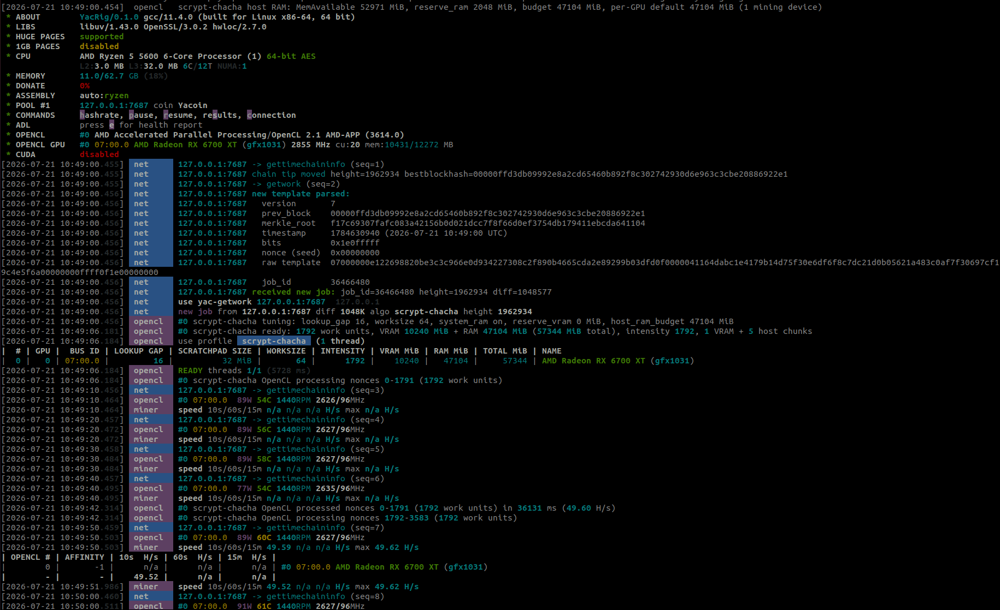

# YAC OpenCL mining with YACRig (AMD GPUs)

This document is the single user-facing reference for mining [Yacoin](https://github.com/yacoin/yacoin) (YAC) on an AMD GPU with YACRig. It covers building the miner with OpenCL support, installing the AMD driver stack, connecting to a `yacoind` instance, tuning the AMD GPU for your hardware, and interpreting the output.

The title says "OpenCL" rather than "GPU" deliberately: this path uses the OpenCL runtime that ships with the AMD driver. NVIDIA GPUs use the separate CUDA path, documented in [`YAC_CUDA_MINING.md`](./YAC_CUDA_MINING.md).

For mining on a CPU instead, see [`YAC_CPU_MINING.md`](./YAC_CPU_MINING.md). The daemon-connection, log-reading, and interactive-command material is shared between the backends, so this document cross-references the CPU guide for those parts and focuses on what is specific to AMD GPUs.

## Table of contents

- [1. What this document covers](#1-what-this-document-covers)
- [2. Building YACRig with OpenCL support](#2-building-yacrig-with-opencl-support)
  - [2.1 One binary, no plugin](#21-one-binary-no-plugin)
  - [2.2 Build prerequisites](#22-build-prerequisites)
  - [2.3 AMD driver and OpenCL runtime, per card](#23-amd-driver-and-opencl-runtime-per-card)
  - [2.4 Building YACRig](#24-building-yacrig)
  - [2.5 Verifying the build](#25-verifying-the-build)
- [3. Connecting to yacoind](#3-connecting-to-yacoind)
  - [3.1 yacoind side: minimum required configuration](#31-yacoind-side-minimum-required-configuration)
  - [3.2 The minimal AMD GPU run](#32-the-minimal-amd-gpu-run)
  - [3.3 AMD GPU-specific commandline options](#33-amd-gpu-specific-commandline-options)
  - [3.4 Using a JSON config file](#34-using-a-json-config-file)
  - [3.5 Running AMD GPU and CPU together](#35-running-amd-gpu-and-cpu-together)
  - [3.6 Interactive runtime commands](#36-interactive-runtime-commands)
- [4. Tuning the AMD GPU for maximum hashrate](#4-tuning-the-amd-gpu-for-maximum-hashrate)
  - [4.1 How scrypt-chacha uses the AMD GPU](#41-how-scrypt-chacha-uses-the-amd-gpu)
  - [4.2 The autotuner](#42-the-autotuner)
  - [4.3 lookup_gap: trading compute for VRAM](#43-lookup_gap-trading-compute-for-vram)
  - [4.4 worksize: the work-group size](#44-worksize-the-work-group-size)
  - [4.5 External RAM: mining past the VRAM ceiling](#45-external-ram-mining-past-the-vram-ceiling)
  - [4.6 The compute-unit ceiling](#46-the-compute-unit-ceiling)
  - [4.7 Reserving VRAM and system RAM](#47-reserving-vram-and-system-ram)
  - [4.8 Per-device tuning with JSON](#48-per-device-tuning-with-json)
- [5. Measured hashrate on tested AMD GPUs](#5-measured-hashrate-on-tested-amd-gpus)
  - [5.1 RX 6700 XT (RDNA2, gfx1031, 12 GB)](#51-rx-6700-xt-rdna2-gfx1031-12-gb)
    - [5.1.1 On a PCIe 4.0 x16 link](#511-on-a-pcie-40-x16-link)
    - [5.1.2 On a PCIe 3.0 x16 link](#512-on-a-pcie-30-x16-link)
    - [5.1.3 What the PCIe link changes](#513-what-the-pcie-link-changes)
  - [5.2 RX 9070 XT (RDNA4, gfx1201, 16 GB)](#52-rx-9070-xt-rdna4-gfx1201-16-gb)
- [6. Reading the log output](#6-reading-the-log-output)
- [7. Troubleshooting](#7-troubleshooting)
- [8. Reference: all useful OpenCL commandline options](#8-reference-all-useful-opencl-commandline-options)

---

## 1. What this document covers

Everything needed to mine YAC on an AMD GPU end-to-end:

- Installing the AMD driver stack with a working OpenCL runtime.
- Building YACRig with the OpenCL backend.
- Pointing the miner at a `yacoind` instance you control.
- Tuning the AMD GPU knobs (`lookup_gap`, `worksize`, `use_system_ram`, `reserve_vram`, `reserve_ram`, `host_ram_budget`, per-device `intensity`) for the best hashrate your card can produce.
- Interpreting the AMD GPU-specific log lines.

**Current capabilities and limitations**

- **AMD GPUs** with a working OpenCL runtime are supported. The kernel is plain OpenCL C compiled at runtime, so it is not tied to a specific GPU generation. [Section 2.3](#23-amd-driver-and-opencl-runtime-per-card) covers the driver stack for RDNA1 through RDNA4.
- **Solo mining via `getwork`** is the supported connection mode, the same as the CPU and CUDA paths.
- **AMD GPU and CPU can mine at the same time.** They draw non-overlapping nonce ranges from a shared per-job counter, so a mixed run does no duplicate work.
- **Multi-GPU** is supported. Each card gets its own runner and can be tuned independently through per-device JSON entries ([section 4.8](#48-per-device-tuning-with-json)).
- **Stratum pool mining** and **`getblocktemplate`** are not supported yet.

**Not covered**

- The protocol-level design of YAC's scrypt-chacha proof-of-work.
- The internal architecture of the OpenCL backend.
- Setting up `yacoind` itself beyond the RPC lines YACRig needs. See [`YAC_CPU_MINING.md` section 3](./YAC_CPU_MINING.md#3-connecting-yacrig-to-yacoind) for that.

---

## 2. Building YACRig with OpenCL support

### 2.1 One binary, no plugin

Unlike the CUDA path, AMD GPU mining needs no second binary:

- The OpenCL backend is compiled into the `yacrig` executable itself.
- The GPU kernel is OpenCL C source embedded in the binary and compiled **at runtime** by the driver's OpenCL compiler, for exactly the card it runs on.
- There is no GPU toolkit to install for building: the build only needs the OpenCL headers and the ICD loader stub, so YACRig builds with full OpenCL support on a machine with no GPU at all.

The runtime requirements on the mining machine reduce to two pieces:

- An AMD driver that provides an OpenCL implementation
- The `libOpenCL.so` ICD loader.

[Section 2.3](#23-amd-driver-and-opencl-runtime-per-card) covers both.

### 2.2 Build prerequisites

- The CPU-mining prerequisites from [`YAC_CPU_MINING.md` section 2.1](./YAC_CPU_MINING.md#21-linux-prerequisites) (`build-essential`, `cmake`, `libuv1-dev`, `libssl-dev`, `libhwloc-dev`, and so on).
- The OpenCL headers and ICD loader development package:

```bash
sudo apt install ocl-icd-opencl-dev opencl-headers
```

That is the whole build-side list. The AMD driver is a runtime requirement on the mining machine, not a build requirement.

### 2.3 AMD driver and OpenCL runtime, per card

The OpenCL runtime a card needs depends on its architecture. A ROCm release only enumerates GPUs that existed when it shipped, so your card dictates the driver version (and sometimes the Ubuntu release):

| GPU family | Example card | gfx target | Minimum ROCm for OpenCL | Ubuntu |
|---|---|---|---|---|
| RDNA1 | RX 5700 XT | `gfx1010` | 6.1.3 (works in practice) | 20.04 / 22.04 |
| RDNA2 | RX 6700 XT | `gfx1031` | 6.1.3 (works in practice) | 20.04 / 22.04 |
| RDNA3 | RX 7900 XTX | `gfx1100` | 6.1.3 (officially supported) | 20.04 / 22.04 |
| RDNA4 | RX 9070 XT | `gfx1201` | 6.4.1 (officially supported) | 22.04 / 24.04 |

**RDNA1 through RDNA3:** one ROCm 6.1.3 install covers all three families.

```bash
# Install the necessary kernel packages to build the amdgpu DKMS module
sudo apt install -y "linux-headers-$(uname -r)" "linux-modules-extra-$(uname -r)"

# Get AMDGPU/ROCm OpenCL driver (focal = 20.04, jammy = 22.04)
# For Ubuntu 20.04 (focal)
wget https://repo.radeon.com/amdgpu-install/6.1.3/ubuntu/focal/amdgpu-install_6.1.60103-1_all.deb
# For Ubuntu 22.04 (jammy)
wget https://repo.radeon.com/amdgpu-install/6.1.3/ubuntu/jammy/amdgpu-install_6.1.60103-1_all.deb

# Install AMDGPU/ROCm OpenCL driver
sudo apt install ./amdgpu-install_6.1.60103-1_all.deb
sudo amdgpu-install -y --usecase=opencl
```

`gfx1010` and `gfx1031` are not on ROCm's official compute-support list, but the OpenCL runtime enumerates them in practice. If `clinfo` does not show the card, re-run the install with `--usecase=opencl --opencl=rocr,legacy`.

**RDNA4:** needs ROCm 6.4.1 or newer and Ubuntu 22.04 / 24.04.

```bash
# Install the necessary kernel packages to build the amdgpu DKMS module
sudo apt install -y "linux-headers-$(uname -r)" "linux-modules-extra-$(uname -r)"

# Get AMDGPU/ROCm OpenCL driver (jammy = 22.04, noble = 24.04)
# For Ubuntu 22.04 (jammy)
wget https://repo.radeon.com/amdgpu-install/6.4.1/ubuntu/jammy/amdgpu-install_6.4.60401-1_all.deb
# For Ubuntu 24.04 (noble)
wget https://repo.radeon.com/amdgpu-install/6.4.1/ubuntu/noble/amdgpu-install_6.4.60401-1_all.deb

# Install AMDGPU/ROCm OpenCL driver
sudo apt install ./amdgpu-install_6.4.60401-1_all.deb
sudo amdgpu-install -y --usecase=opencl
```

Check the [repo index](https://repo.radeon.com/amdgpu-install/) for the newest 6.4.x first, and stay on the GA or matching HWE kernel. The amdgpu DKMS module can fail to build on very new kernels.

**One ROCm version cannot span the whole range:** 6.1.3 cannot see RDNA4, and 6.4.x drops official RDNA1 support. A machine holding both an RDNA1 and an RDNA4 card cannot enumerate both under one ROCm install: keep them on separate boxes.

**After installing AMDGPU/ROCm OpenCL driver:**

```bash
sudo usermod -a -G render,video $LOGNAME
sudo reboot
```

Then verify the card is enumerated:

```bash
clinfo -l
clinfo | grep -E "Board name|Device Name|gfx"
```

### 2.4 Building YACRig

From the YACRig repository root:

```bash
cmake -S . -B build \
      -DWITH_SCRYPT_CHACHA=ON \
      -DWITH_OPENCL=ON \
      -DWITH_HTTP=ON
cd build
make -j$(nproc)
```

| CMake flag | Default | Why YACRig needs it |
|------------|---------|---------------------|
| `WITH_OPENCL=ON` | ON | Compiles the OpenCL backend and embeds the scrypt-chacha kernel source. |
| `WITH_SCRYPT_CHACHA=ON` | ON | Compiles the YAC client and the CPU re-verification kernel (every AMD GPU candidate is re-checked on the CPU before submission). |
| `WITH_HTTP=ON` | ON | Enables the HTTP client used to talk to yacoind over JSON-RPC. |

All three are on by default, so a plain `cmake -S . -B build` produces an OpenCL-capable binary.

### 2.5 Verifying the build

Two checks confirm the AMD GPU path is wired up.

**1. YACRig enumerates your AMD GPUs.** Ask it to print the detected OpenCL platforms and their GPU devices:

```bash
./yacrig --print-devices
```

Example result:
```
Number of OpenCL platforms: 1

  Platform index:           0
  Name:                     AMD Accelerated Parallel Processing
  Version:                  OpenCL 2.1 AMD-APP (3614.0)
  GPU devices:              1

    Index:                  0
    Name:                   AMD Radeon RX 6700 XT (gfx1031)
    Bus ID:                 0b:00.0
    Clock:                  2855 MHz
    Compute units:          20
    Memory (cap/total):     10431/12272 MB
```

The memory pair is the largest single buffer the OpenCL runtime lets the miner allocate, against the card's total memory (the autotuner probes live free VRAM separately at startup).

The `Index` value is the device index used by `--opencl-devices` and the per-device `"index"` key ([section 4.8](#48-per-device-tuning-with-json)), and it matches the `#N` on the `OPENCL GPU` lines of the mining startup banner. If the AMD platform is missing, or it shows `GPU devices: 0`, see [section 7](#7-troubleshooting).

**2. The kernel is bit-correct on your card.** The build tree includes a standalone golden-vector harness (`scrypt_chacha_test_ocl`, built automatically when a `libOpenCL.so` is present). It compiles the shipped kernel on a GPU you select and checks the full 32-byte hash, plus the mining entry point itself, against golden YAC block headers:

```bash
make scrypt_chacha_test_ocl
./scrypt_chacha_test_ocl                 # runs on the first GPU listed
OCL_DEVICE=1 ./scrypt_chacha_test_ocl    # pick another GPU from the printed list
```

It prints `vector N: OK` per vector and exits 0 only when every vector matches. Running it once on a new card before trusting hashrate numbers confirms the kernel produces exactly the bytes the YAC network expects, so any later "rejected share" issue is network- or daemon-side, not kernel-side.

---

## 3. Connecting to yacoind

The daemon side is identical to CPU mining: only the `--opencl` flags are added on top. The yacoind-side configuration is covered by reference in [section 3.1](#31-yacoind-side-minimum-required-configuration), and the rest of this section covers the AMD GPU run commands, the GPU options, mixing with the CPU, and the runtime commands.

### 3.1 yacoind side: minimum required configuration

The `yacoind` configuration YACRig needs (`server=1`, `rpcuser`/`rpcpassword`, at least one P2P peer, an unlocked wallet, and the daemon past initial-block-download) is identical to CPU mining, and nothing about it changes for AMD GPU mining. It is documented in full in [`YAC_CPU_MINING.md` section 3.1](./YAC_CPU_MINING.md#31-yacoind-side-minimum-required-configuration).

### 3.2 The minimal AMD GPU run

With `yacoind` configured, the invocations below build up from minimal to fully-configured. Pick the one that fits your needs:

```bash
# 1. The basic AMD GPU command. The autotuner picks the launch configuration.
./yacrig --coin=yac --daemon -o <host>:<rpcport> -u <rpcuser> -p <rpcpassword> --opencl

# 2. Mine on the AMD GPU only, and show the per-device tuning and nonce ranges
./yacrig --coin=yac --daemon -o <host>:<rpcport> -u <rpcuser> -p <rpcpassword> \
         --opencl --no-cpu --print-time=<seconds> --verbose

# 3. Tune the scratchpad/compute trade-off and spill into host RAM
./yacrig --coin=yac --daemon -o <host>:<rpcport> -u <rpcuser> -p <rpcpassword> \
         --opencl --no-cpu --opencl-lookup-gap=<gap> --opencl-worksize=<ws> \
         --opencl-use-system-ram --opencl-host-ram-budget=<MiB> \
         --print-time=<seconds> --verbose
```

`--opencl` is the only flag strictly required to add the AMD GPU. With nothing else set, the autotuner fills each card's free VRAM with scrypt-chacha scratchpads and starts mining. The remaining flags are tuning, covered in [section 4](#4-tuning-the-amd-gpu-for-maximum-hashrate).

A concrete fully-configured AMD GPU-only run against a local daemon, using one of the best measured RX 6700 XT configurations from [section 5.1.1](#511-on-a-pcie-40-x16-link) (lookup gap 16, worksize 64, external RAM 44GB). The host budget suits that machine: a PCIe 4.0 x16 link with tens of GB of spare system RAM. On a slower link or a smaller machine the right budget is lower, and [section 4.5](#45-external-ram-mining-past-the-vram-ceiling) explains how to find it:

```bash
./yacrig --coin=yac --daemon \
         -o 127.0.0.1:7687 \
         -u yacuser -p yacpass \
         --opencl --no-cpu \
         --opencl-lookup-gap=16 --opencl-worksize=64 \
         --opencl-use-system-ram --opencl-host-ram-budget=45056 \
         --print-time=30 \
         --verbose
```

### 3.3 AMD GPU-specific commandline options

The tuning options below are the AMD GPU additions to the shared network/logging options documented in the CPU guide. Each one also has a JSON-config equivalent (see [section 4.8](#48-per-device-tuning-with-json)) and the full reference table is in [section 8](#8-reference-all-useful-opencl-commandline-options).

| Option | Default | Description |
|--------|---------|-------------|
| `--opencl` | off | Enable the OpenCL backend. **Required** to mine on the AMD GPU. |
| `--opencl-devices=N,...` | all | Comma-separated list of OpenCL device indices to use. Omit to use every device on the platform. |
| `--opencl-platform=N` | auto | OpenCL platform index or name. Set it when more than one platform is installed (for example AMD next to Intel). |
| `--opencl-loader=PATH` | system | Path to the OpenCL ICD loader (`libOpenCL.so`). Only needed when the loader is not on the default library path. |
| `--opencl-lookup-gap=N` | `32` | Scratchpad/compute trade-off. `1` stores the whole scratchpad, higher values store less and recompute more. See [section 4.3](#43-lookup_gap-trading-compute-for-vram). |
| `--opencl-worksize=N` | `32` | OpenCL work-group size. See [section 4.4](#44-worksize-the-work-group-size). |
| `--opencl-use-system-ram` | off | Spill scrypt-chacha scratchpads into host RAM once VRAM is full. See [section 4.5](#45-external-ram-mining-past-the-vram-ceiling). |
| `--opencl-reserve-vram=N` | `0` (MiB) | VRAM the autotuner leaves free per AMD GPU. Use on a card that also drives a display. See [section 4.7](#47-reserving-vram-and-system-ram). |
| `--opencl-reserve-ram=N` | `4096` (MiB) | Host RAM left for the OS and other processes. Caps how much system RAM the AMD GPUs may claim when `--opencl-use-system-ram` is set. |
| `--opencl-host-ram-budget=N` | `4096` (MiB) | Total host RAM for scratchpads across all AMD GPUs, split evenly. `0` means "use the whole `MemAvailable - reserve-ram` budget". |

### 3.4 Using a JSON config file

For anything beyond a one-line invocation, putting the settings in a JSON config file is more convenient than retyping them on every restart. The GPU-only concrete run from [section 3.2](#32-the-minimal-amd-gpu-run), expressed as `config.json`:

```json
{
    "opencl": {
        "enabled": true,
        "lookup_gap": 16,
        "worksize": 64,
        "use_system_ram": true,
        "host_ram_budget_mb": 45056
    },
    "cpu": {
        "enabled": false
    },
    "pools": [
        {
            "url": "127.0.0.1:7687",
            "user": "yacuser",
            "pass": "yacpass",
            "coin": "yac",
            "daemon": true
        }
    ],
    "print-time": 30,
    "verbose": 1
}
```

Run YACRig with the config file:

```bash
./yacrig --config=config.json
```

Notes:

- `"opencl": { "enabled": true }` is the JSON form of `--opencl`.
- `"cpu": { "enabled": false }` is the JSON form of `--no-cpu`. Drop it (or set it to `true`) to mine on the CPU alongside the GPU (see [section 3.5](#35-running-amd-gpu-and-cpu-together)).
- The `pools` entry needs `"coin": "yac"` and `"daemon": true`, exactly as for CPU mining. The array can hold multiple endpoints for failover.
- The GPU tuning knobs (`lookup_gap`, `worksize`, `use_system_ram`, `reserve_vram_mb`, `reserve_ram_mb`, `host_ram_budget_mb`) and the per-device overrides all live in the `"opencl"` block. They are documented in [section 4.8](#48-per-device-tuning-with-json).
- Commandline options override the corresponding JSON values when both are present, so you can keep a base `config.json` and tweak one knob on the command line: `./yacrig --config=config.json --opencl-lookup-gap=32`.
- On the first run YACRig writes the autotuned launch back into the config file as a per-device `"scrypt-chacha"` entry, so later runs reuse the same launch without re-tuning ([section 4.2](#42-the-autotuner)).

### 3.5 Running AMD GPU and CPU together

AMD GPU and CPU mining run at the same time by default:

- **Drop `--no-cpu`** to keep CPU worker threads mining alongside the AMD GPU. The CPU autotuner ([`YAC_CPU_MINING.md` section 4.1](./YAC_CPU_MINING.md#41-the-autotuner)) picks the thread count exactly as in a CPU-only run.
- **Add `--no-cpu`** to mine on the AMD GPU only.

The two backends never mine the same nonce. Every CPU worker and every AMD GPU draws a distinct block of nonces from a single shared per-job counter, so a mixed run does no duplicate work. With `--verbose`, each backend tags its log lines (`cpu #<id> scrypt-chacha CPU processing nonces ...` versus `#<idx> scrypt-chacha OpenCL processing nonces ...`) and you can read off the contiguous, non-overlapping ranges each is mining.

One practical note for mixed runs: leave some CPU threads free for the GPU. Each GPU candidate is re-verified on the CPU before submission, and a fully-loaded CPU also slows the host side of external-RAM mining.

### 3.6 Interactive runtime commands

The single-character runtime commands (`h` hashrate, `p` pause, `r` resume, `s` results, `c` connection, `Ctrl+C` exit) work exactly as in CPU mining and apply to the AMD GPU backend too. They are documented in [`YAC_CPU_MINING.md` section 3.4](./YAC_CPU_MINING.md#34-interactive-runtime-commands).

`Ctrl+C` is worth one AMD GPU-specific note: a long scrypt-chacha launch is aborted promptly on shutdown rather than blocking until the launch finishes, so the miner exits within seconds instead of appearing to hang. The kernel polls a stop flag while it works, and the same early-abort fires when a new block arrives mid-launch.

---

## 4. Tuning the AMD GPU for maximum hashrate

### 4.1 How scrypt-chacha uses the AMD GPU

scrypt-chacha is a memory-heavy proof-of-work. Understanding four terms makes the tuning knobs below intuitive:

- **The scratchpad is large.** Each hash walks a scratchpad of `N = 2^22` blocks. Stored in full that is 512 MiB per hash, so memory capacity, not GPU cores, is almost always the limit.
- **`lookup_gap` shrinks the scratchpad.** Storing only every `lookup_gap`-th entry and recomputing the rest trades compute for memory. Per work unit the scratchpad is 32 MiB at gap 16, 16 MiB at gap 32, and 8 MiB at gap 64.
- **Work units are packed into work-groups.** A work unit computes one hash. `worksize` work units form one OpenCL work-group, which allocates its scratchpad as one block (`worksize x per-work-unit scratchpad`, for example 2 GiB per group at gap 16 and worksize 64).
- **`intensity` is the total work-unit count**, the number of nonces one kernel launch processes. It always equals `groups x worksize`. The autotuner derives it from the memory budget, and it can be pinned per device ([section 4.8](#48-per-device-tuning-with-json)).

The knobs in this section all manage the same budget: how much VRAM (and optionally host RAM) is available for scratchpads, how large each scratchpad is, and how the work units are grouped.

### 4.2 The autotuner

When YACRig starts with no per-device configuration, it sizes each AMD GPU automatically:

- It queries the card's **free VRAM** directly (AMD's OpenCL extension reports it). On a runtime without that query it falls back to total VRAM minus a small margin.
- It subtracts the VRAM reserve ([section 4.7](#47-reserving-vram-and-system-ram)), divides by the per-group scratchpad size at the active `lookup_gap` and `worksize`, and fills the remaining VRAM with work-groups.
- With `--opencl-use-system-ram` it adds host-RAM work-groups on top, up to the host budget ([section 4.5](#45-external-ram-mining-past-the-vram-ceiling)).
- The resulting launch is written back into the config file as a concrete per-device entry, so the next run starts with the same launch immediately.

A per-device entry can also carry `"intensity": 0`, which means "size this launch at startup from the current free memory" while keeping the other knobs pinned. Under `--verbose` the sizing decision is printed:

```
ocl  #0 scrypt-chacha auto intensity: 5 VRAM + 22 host work-groups, intensity 1728
```

The autotuner needs no input: a bare `--opencl` run lands on a sensible VRAM-only launch. The knobs below override or extend its decisions, and on AMD cards the measured gains from tuning are large. On the two RX 6700 XT machines in [section 5.1](#51-rx-6700-xt-rdna2-gfx1031-12-gb) the defaults land at 12.4 and 12.2 H/s, while full tuning reaches 49.0 and 34.9 H/s: about 4x on the machine with the faster PCIe link and more system RAM, and 2.9x on the other.

### 4.3 lookup_gap: trading compute for VRAM

`--opencl-lookup-gap=N` controls how much of the scratchpad is stored versus recomputed on demand:

- `--opencl-lookup-gap=1` stores the entire scratchpad. Maximum memory use, minimum compute, very few work units fit.
- `--opencl-lookup-gap=32` (the default) stores every 32nd entry. Each work unit needs 16 MiB instead of 512 MiB.
- Higher values shrink the scratchpad further and cost more compute per hash. Launch duration grows roughly linearly with the gap.

Practical guidance, measured on RDNA2 ([section 5.1](#51-rx-6700-xt-rdna2-gfx1031-12-gb)):

- **The best gap falls as the host budget grows.** A lower gap stores more per work unit, so fewer work-groups fit a given budget, but each runs faster. The winning gap at each budget is the one that fills the card closest to its compute-unit ceiling ([section 4.6](#46-the-compute-unit-ceiling)) without going over. Both test machines show the same order: gap 64 at the small budgets, gap 32 through the middle, gap 16 at the largest. How far along that order you get depends on how much host RAM you can give the card.
- **Gap 16 is the target only if you can feed it.** It needs the largest budgets to win, and there it is the only gap whose lower thread density keeps the work-group count under the compute-unit ceiling. With tens of GB of system RAM it holds the overall peak (49.0 H/s at 47104 MiB). Capped at 27648 MiB it wins only the very top budget, and by then the link, not the gap, is setting the rate.
- **The default gap 32 is the safe middle ground.** It is the best VRAM-only choice on both machines, it wins across the mid host budgets on both, and on the more RAM-limited one it holds the best result outright (34.9 H/s at 24576 MiB). A card that will not be given tens of GB has little reason to change it.
- **Gap 64 pays off only with a small external budget,** roughly 4 to 8 GB, where the higher gap is needed to fill the card. Both machines put gap 64 with worksize 64 at 21.6 H/s at 8192 MiB, the best result at that budget on either. Below and above that band it is the slowest of the three, so it is not the value to reach for VRAM-only. (The CUDA backend defaults to gap 64 instead: the two backends' kernels have different sweet spots.)
- `lookup_gap` does **not** change the hash result. Any value that fits in memory produces the same bytes, so it is purely a performance knob.

### 4.4 worksize: the work-group size

`--opencl-worksize=N` sets how many work units form one OpenCL work-group. It shapes the launch twice: it multiplies the per-group scratchpad size, and it sets how much of the card a launch occupies (a full 64-lane group fills one RDNA compute unit).

Measured guidance ([section 5.1](#51-rx-6700-xt-rdna2-gfx1031-12-gb)):

- **`worksize = 64` wins with external RAM.** It takes almost every best row on both test machines and carries both peaks. A worksize-64 group fills a compute unit's full 64 lanes, so with a large launch it does more useful work per compute unit and reaches the compute-unit ceiling ([section 4.6](#46-the-compute-unit-ceiling)) with fewer, fuller groups.
- **The default `worksize = 32` wins VRAM-only,** on both machines and by about 4% each time. With no host budget the launch has few work-groups, and the narrower 32-lane groups spread that small amount of work across more of the card. It also takes an odd external budget at either end of the range, never by more than about 4%, so one A/B run at your own budget is worth more than a rule.
- `worksize = 128` doubles the compute-unit cost per group for no gain, and very small work-groups (16) measurably lose. Stay on 32 or 64.

### 4.5 External RAM: mining past the VRAM ceiling

`--opencl-use-system-ram` lets the autotuner add scratchpad work-groups in host system RAM (reachable from the AMD GPU over PCIe) once VRAM is full:

```bash
./yacrig ... --opencl --opencl-use-system-ram --opencl-host-ram-budget=<MiB>
```

- This raises the work-unit count past what VRAM alone allows, and it is the single largest hashrate lever on both test machines: the best external-RAM configuration reaches 49.0 H/s on a PCIe 4.0 x16 link and 34.9 H/s on a PCIe 3.0 x16 one, against VRAM-only defaults of 12.4 and 12.2 H/s ([section 5.1](#51-rx-6700-xt-rdna2-gfx1031-12-gb)). A slower link lowers the ceiling, it does not remove the gain.
- The host-RAM work units are read over PCIe, which is slower than on-card memory. The miner orders the work so the slow host-mapped groups overlap with the fast VRAM groups.
- By default the per-GPU share of system RAM is the `--opencl-host-ram-budget` (4096 MiB) split evenly across all mining AMD GPUs. Set `--opencl-host-ram-budget=0` to instead use the whole `MemAvailable - reserve-ram` budget.
- The budget buys whole work-groups. At gap 16 and worksize 64 one host group costs 2 GiB, so budgets only matter in 2 GiB steps at that configuration.
- Two safety rails guard the budget at startup. A **global** budget larger than the host can back (`MemAvailable` minus `--opencl-reserve-ram`) is clamped to what exists, with an error line, and mining continues. A **per-device pinned** budget (in a `"scrypt-chacha"` entry) that over-subscribes the host is a fatal misconfiguration: YACRig logs an error and exits rather than over-committing memory.

**How much host RAM to give it:** hashrate climbs with the budget until either the compute-unit ceiling ([section 4.6](#46-the-compute-unit-ceiling)) or PCIe saturation stops it, and then it falls. More RAM is not always better.

- **The peak budget is a property of your link, not of the card.** The same RX 6700 XT peaks at a 47104 MiB budget (49.0 H/s) on PCIe 4.0 x16 and at 24576 MiB (34.9 H/s) on PCIe 3.0 x16. Half the bandwidth moves the turning point to roughly half the budget ([section 5.1.3](#513-what-the-pcie-link-changes)).
- **The decline past the peak is real, not a measurement artifact.** On the PCIe 4.0 machine the rate falls from 49.0 to 45.7 H/s between 47104 and 49152 MiB. On the PCIe 3.0 machine it falls from 34.9 to 33.2 H/s between 24576 and 27648 MiB, with the work-group count still well under the compute-unit ceiling the whole way, which leaves the link as the only explanation.
- **Below roughly 12 GB of host scratchpad the link generation stops mattering.** The two machines land within a few percent of each other there, so a modest budget is worth taking on any link.
- **So find your own peak.** Start at 8192, confirm the gain, then step up and keep the largest budget that still improves the per-launch H/s. The `processed ... H/s` line ([section 6](#6-reading-the-log-output)) is the measurement to watch.

### 4.6 The compute-unit ceiling

The sharpest rule measured on RDNA2: **keep the work-group count at or below the card's compute-unit count.** The work-group count is `intensity / worksize`, and the RX 6700 XT has 40 compute units. A launch runs at full speed up to 40 work-groups and degrades past it. Both worksizes obey the rule, and each shows the overflow differently:

- **Worksize 64 degrades as a uniform stretch.** The gap-32 / worksize-64 sweep climbs smoothly to 41.3 H/s at 40 work-groups (host budget 29696 MiB), then collapses to 24.2 H/s at 41 work-groups (30720 MiB), a ~40% loss: every launch takes proportionally longer because the 41st group cannot get its own compute unit.
- **Worksize 32 degrades into a fast/slow rhythm.** Gap 16 / worksize 32 peaks at 40 work-groups (37.1 H/s at 29696 MiB) and drops at 41 (30.6 H/s at 30720 MiB). The launches alternate between a fast pass (~34 s, 38.0 H/s) and a slow pass (~53 s, 24.6 H/s), with board power falling to about a third on the slow ones (visible in the `--verbose` health line as the wattage dropping to ~29 W). The card toggles in and out of a low-power state because the launch does not fit its compute units cleanly, and the average over a run lands below the 40-work-group rate.
- **Staying under the ceiling is what wins.** This is why gap 16 with worksize 64 takes the large budgets ([section 4.3](#43-lookup_gap-trading-compute-for-vram)): its lower thread density keeps the work-group count under 40 where gap 32 has already overflowed. The overall peak sits at 28 work-groups (47104 MiB), comfortably under the ceiling.
- **The rule holds on both test machines.** On the second one every row at 39 work-groups or fewer runs at full speed and every row at 47 or more degrades, in the same two ways and with the same split by worksize, which brackets the boundary from a different set of budgets ([section 5.1.2](#512-on-a-pcie-30-x16-link)). It holds with and without external RAM, so it is the launch geometry that decides, not where the scratchpads live.
- **Far past the ceiling the two failure modes converge.** At 143 work-groups a worksize-32 launch stops alternating and simply runs uniformly slow. The fast/slow rhythm is what the card does when a launch nearly fits, not a permanent state.

To apply the rule on your card: find its compute-unit count, then size `intensity / worksize` to stay at or below it. Note that `clinfo` and `--print-devices` report **half** the marketing compute-unit count for RDNA cards (the RX 6700 XT shows 20 for its 40 units), and the rule uses the marketing count.

### 4.7 Reserving VRAM and system RAM

Two reserves keep the machine responsive and the allocation safe:

- `--opencl-reserve-vram=N` leaves `N` MiB of VRAM untouched per AMD GPU. The autotuner already works from the card's **free** VRAM (the AMD runtime reports what the desktop and other processes are using), so this is only needed to hold extra headroom, for example for an application you will start later. On a dedicated mining card leave it at 0.
- `--opencl-reserve-ram=N` (default 4096 MiB) leaves host RAM for the OS and other processes. It caps how much system RAM the AMD GPUs may claim when `--opencl-use-system-ram` is set.

If a reserve is set so high that not even one work-group fits, the device is skipped with a warning and the rest of the miner keeps running ([section 7](#7-troubleshooting)).

### 4.8 Per-device tuning with JSON

Every knob has a global JSON equivalent on the `"opencl"` block, plus per-device overrides on each entry in the `"scrypt-chacha"` array. Per-device values win over the global default for that AMD GPU. This is the way to give two cards in one rig different settings, and the only place the launch size (`intensity`) can be pinned directly.

```json
{
    "opencl": {
        "enabled": true,
        "lookup_gap": 32,
        "worksize": 32,
        "use_system_ram": false,
        "reserve_vram_mb": 0,
        "reserve_ram_mb": 4096,
        "host_ram_budget_mb": 4096,
        "scrypt-chacha": [
            { "index": 0, "intensity": 0, "worksize": 64, "lookup_gap": 16,
              "use_system_ram": true, "host_ram_budget_mb": 24576 },
            { "index": 1, "intensity": 736, "worksize": 32 }
        ]
    },
    "pools": [
        {
            "url": "127.0.0.1:7687",
            "user": "yacuser",
            "pass": "yacpass",
            "coin": "yac",
            "daemon": true
        }
    ]
}
```

Run it with `./yacrig --config=config.json`. Notes:

- When the `"scrypt-chacha"` array is present, **only the cards listed in it mine scrypt-chacha**. Omit the array entirely to let the autotuner configure every card.
- `"index"` is the OpenCL device index: the `Index` printed by `--print-devices` ([section 2.5](#25-verifying-the-build)), which also appears as the `#N` on the startup banner's `OPENCL GPU` lines.
- `"intensity"` is the launch's total work-unit count. The launch works in whole work-groups, so use a multiple of the entry's `worksize` (a non-multiple rounds down). `0` means "size it at startup from the current free memory" (the auto marker the autotuner writes). A pinned intensity is honored exactly, as long as the memory backs it.
- The per-device override keys are `intensity`, `worksize`, `lookup_gap`, `use_system_ram`, `reserve_vram_mb`, and `host_ram_budget_mb`. A knob absent from the entry falls back to the global `"opencl"` value. `reserve_ram_mb` is host-level only and never appears per device.
- `host_ram_budget_mb` works at both levels. **Global:** the total system RAM for scratchpads, split evenly across the mining AMD GPUs (`0` = the whole `MemAvailable - reserve_ram_mb` budget). **Per device:** sets exactly how much system RAM that one AMD GPU may use, overriding its even share.
- Only GPUs with an array entry count toward the even split and the over-subscription check, so an entry-less card in the machine does not dilute the budget of the cards that mine.
- YACRig logs an error and exits at startup when the per-device `host_ram_budget_mb` values sum past what the host can give (`MemAvailable` minus `reserve_ram_mb`). An oversized **global** budget is clamped instead, and mining continues.
- Commandline options override the corresponding global JSON values when both are present, the same as for CPU mining.

---

## 5. Measured hashrate on tested AMD GPUs

This section collects scrypt-chacha hashrate numbers from real YACRig runs. Two uses:

- **Set expectations** before you start mining on a given card. If your own run is well below the number for the same configuration, you have a configuration or thermal problem to chase.
- **Compare configurations.** The tables walk the tuning space, so you can read off what each knob is worth before spending your own time sweeping it.
- **See what carries and what does not.** The same card should be tested on different PCIe generations so that we can easily separate the results that come from the card from those that come from the rest of the machine.

The numbers are the steady-state per-launch hashrate, measured full-pipeline (pre-Keccak, the ROMix core, and post-Keccak all counted). Work units is the launch's `intensity`. Within a table, rows are sorted by RAM usage, then lookup gap, then worksize.


### 5.1 RX 6700 XT (RDNA2, gfx1031, 12 GB)

The card reports 20 compute units, which is 40 by the marketing count [section 4.6](#46-the-compute-unit-ceiling) uses.

The same card was swept on two machines that differ in the one thing external-RAM mining depends on most: the PCIe link the host scratchpads are read over. Both boxes ran a dedicated card with no display attached, and both report the same free VRAM, so the VRAM-only rows are directly comparable.

- [Section 5.1.1](#511-on-a-pcie-40-x16-link) is the PCIe 4.0 x16 box, with enough system RAM to sweep the host budget to 49152 MiB.
- [Section 5.1.2](#512-on-a-pcie-30-x16-link) is the PCIe 3.0 x16 box, whose 32 GB of system RAM caps the host budget at 27648 MiB.
- [Section 5.1.3](#513-what-the-pcie-link-changes) compares the two and gives the rule for reading them against your own machine.

#### 5.1.1 On a PCIe 4.0 x16 link

Test box: PCIe 4.0 x16, about 53 GB of system RAM available to the miner. Each row is a sustained run of about 35 minutes.

| RAM usage | Lookup gap | Worksize | Work units | Work groups | Hashrate (H/s) | Note |
|---|---|---|---|---|---|---|
| none (VRAM only) | 16 | 32 | 352 | 11 | 10.6 |  |
| none (VRAM only) | 16 | 64 | 320 | 5 | 9.6 |  |
| none (VRAM only) | 32 | 32 | 736 | 23 | **12.4** | **Autotuner default, and the best VRAM-only configuration.** |
| none (VRAM only) | 32 | 64 | 704 | 11 | 11.9 |  |
| none (VRAM only) | 64 | 32 | 1504 | 47 | 8.1 |  |
| none (VRAM only) | 64 | 64 | 1472 | 23 | 10.5 |  |
| 4096 MiB | 16 | 32 | 480 | 15 | 14.1 |  |
| 4096 MiB | 16 | 64 | 448 | 7 | 13.2 |  |
| 4096 MiB | 32 | 32 | 992 | 31 | **16.5** | **Best at 4096 MiB.** |
| 4096 MiB | 32 | 64 | 960 | 15 | 16.0 |  |
| 4096 MiB | 64 | 32 | 2016 | 63 | 9.3 |  |
| 4096 MiB | 64 | 64 | 1984 | 31 | 16.1 |  |
| 8192 MiB | 16 | 32 | 608 | 19 | 17.7 |  |
| 8192 MiB | 16 | 64 | 576 | 9 | 16.8 |  |
| 8192 MiB | 32 | 32 | 1248 | 39 | 20.6 |  |
| 8192 MiB | 32 | 64 | 1216 | 19 | 20.1 |  |
| 8192 MiB | 64 | 32 | 2528 | 79 | 9.9 |  |
| 8192 MiB | 64 | 64 | 2496 | 39 | **21.6** | **Best at 8192 MiB.** |
| 12288 MiB | 16 | 32 | 736 | 23 | 21.4 |  |
| 12288 MiB | 16 | 64 | 704 | 11 | 20.5 |  |
| 12288 MiB | 32 | 32 | 1504 | 47 | 18.7 |  |
| 12288 MiB | 32 | 64 | 1472 | 23 | **24.2** | **Best at 12288 MiB.** |
| 12288 MiB | 64 | 32 | 3040 | 95 | 12.0 |  |
| 12288 MiB | 64 | 64 | 3008 | 47 | 10.8 |  |
| 24576 MiB | 16 | 32 | 1120 | 35 | 32.5 |  |
| 24576 MiB | 16 | 64 | 1088 | 17 | 31.6 |  |
| 24576 MiB | 32 | 32 | 2272 | 71 | 24.3 |  |
| 24576 MiB | 32 | 64 | 2240 | 35 | **36.3** | **Best at 24576 MiB.** |
| 24576 MiB | 64 | 32 | 4576 | 143 | 23.2 |  |
| 24576 MiB | 64 | 64 | 4544 | 71 | 22.5 |  |
| 25600 MiB | 16 | 32 | 1152 | 36 | 33.4 |  |
| 25600 MiB | 16 | 64 | 1088 | 17 | 31.6 |  |
| 25600 MiB | 32 | 32 | 2336 | 73 | 23.3 |  |
| 25600 MiB | 32 | 64 | 2304 | 36 | **37.2** | **Best at 25600 MiB.** |
| 26624 MiB | 16 | 32 | 1184 | 37 | 34.3 |  |
| 26624 MiB | 16 | 64 | 1152 | 18 | 33.4 |  |
| 26624 MiB | 32 | 32 | 2400 | 75 | 23.9 |  |
| 26624 MiB | 32 | 64 | 2368 | 37 | **38.2** | **Best at 26624 MiB.** |
| 27648 MiB | 16 | 32 | 1216 | 38 | 35.3 |  |
| 27648 MiB | 16 | 64 | 1152 | 18 | 33.4 |  |
| 27648 MiB | 32 | 32 | 2464 | 77 | 24.6 |  |
| 27648 MiB | 32 | 64 | 2432 | 38 | **39.4** | **Best at 27648 MiB.** |
| 28672 MiB | 16 | 32 | 1248 | 39 | 36.2 |  |
| 28672 MiB | 16 | 64 | 1216 | 19 | 35.3 |  |
| 28672 MiB | 32 | 32 | 2528 | 79 | 25.2 |  |
| 28672 MiB | 32 | 64 | 2496 | 39 | **40.4** | **Best at 28672 MiB.** |
| 29696 MiB | 16 | 32 | 1280 | 40 | 37.1 |  |
| 29696 MiB | 16 | 64 | 1216 | 19 | 35.3 |  |
| 29696 MiB | 32 | 32 | 2592 | 81 | 26.1 |  |
| 29696 MiB | 32 | 64 | 2560 | 40 | **41.3** | **Best at 29696 MiB, and the best gap-32 result (40 work groups, matching the card's 40 compute units).** |
| 30720 MiB | 16 | 32 | 1312 | 41 | 30.6 | 41 work-groups, over the compute-unit ceiling: launches alternate between fast (38.0 H/s) and slow (24.6 H/s) as the card drops to a low-power state. |
| 30720 MiB | 16 | 64 | 1280 | 20 | **37.1** | **Best at 30720 MiB** (20 work-groups, under the compute-unit ceiling). |
| 30720 MiB | 32 | 32 | 2656 | 83 | 26.6 |  |
| 30720 MiB | 32 | 64 | 2624 | 41 | 24.2 |  |
| 36864 MiB | 16 | 32 | 1504 | 47 | 35.9 |  |
| 36864 MiB | 16 | 64 | 1472 | 23 | **42.3** | **Best at 36864 MiB.** |
| 36864 MiB | 32 | 32 | 3040 | 95 | 30.2 |  |
| 36864 MiB | 32 | 64 | 3008 | 47 | 31.6 |  |
| 36864 MiB | 64 | 32 | 6112 | 191 | 16.9 |  |
| 36864 MiB | 64 | 64 | 6080 | 95 | 17.7 |  |
| 40960 MiB | 16 | 64 | 1600 | 25 | 45.4 |  |
| 43008 MiB | 16 | 64 | 1664 | 26 | 46.8 |  |
| 45056 MiB | 16 | 64 | 1728 | 27 | 48.1 |  |
| 47104 MiB | 16 | 64 | 1792 | 28 | **49.0** | **Highest hashrate of all measured configurations.** |
| 49152 MiB | 16 | 32 | 1888 | 59 | 42.6 |  |
| 49152 MiB | 16 | 64 | 1856 | 29 | **45.7** | **Best at 49152 MiB, and the clearest sign of PCIe saturation: past the 47104 MiB peak, more host RAM lowers the rate.** |
| 49152 MiB | 32 | 32 | 3808 | 119 | 36.7 |  |
| 49152 MiB | 32 | 64 | 3776 | 59 | 36.9 |  |
| 49152 MiB | 64 | 32 | 7648 | 239 | 25.8 |  |
| 49152 MiB | 64 | 64 | 7616 | 119 | 26.4 |  |

The single best configuration measured on this card is **`--opencl --opencl-lookup-gap=16 --opencl-worksize=64 --opencl-use-system-ram --opencl-host-ram-budget=47104`**, at **49.0 H/s** (about 4x the VRAM-only autotuner default of 12.4 H/s).

The 45056 MiB budget reaches 48.1 H/s using roughly 2 GB less system RAM, so it is a fine lighter-weight target.

Reading the table as tuning rules (they generalize to other RDNA cards, the exact numbers will differ):

- **External RAM is the biggest lever.** The best rate climbs from 12.4 H/s VRAM-only to 49.0 H/s with a 47104 MiB host budget. VRAM alone holds too few work-groups on a 12 GB card, so almost all the throughput comes from spilling scratchpads into host RAM. See [section 4.5](#45-external-ram-mining-past-the-vram-ceiling).
- **The best lookup gap falls as the host budget grows.** At a fixed budget the winning row is the one that fills the card closest to its 40 compute units without going over, and a lower gap needs more memory per work-group, so it takes a bigger budget to get there. Gap 64 wins only at the smallest external budget (21.6 H/s at 8192 MiB), gap 32 wins through the mid budgets (up to 41.3 H/s at 29696 MiB), and gap 16 wins at the large budgets and holds the overall peak (49.0 H/s at 47104 MiB). See [section 4.3](#43-lookup_gap-trading-compute-for-vram).
- **worksize 64 wins with external RAM, worksize 32 at the small end.** A worksize-32 group is half the threads of a worksize-64 group but still occupies a whole compute unit, so worksize 64 reaches the compute-unit ceiling later and packs more useful threads under it: it takes the best row at every budget from 8192 MiB up. Worksize 32 wins VRAM-only and at the 4096 MiB budget, where the few groups are filled more completely. See [section 4.4](#44-worksize-the-work-group-size).
- **The compute-unit ceiling caps every configuration.** A launch runs at full speed up to 40 work-groups, exactly the card's 40 compute units, and degrades past it at either worksize. Gap 32 / worksize 64 climbs to 41.3 H/s at 40 work-groups (29696 MiB) then collapses to 24.2 H/s at 41 (30720 MiB). Gap 16 / worksize 32 peaks at 37.1 H/s at 40 work-groups (29696 MiB) and drops to 30.6 H/s at 41 (30720 MiB), falling into a bimodal fast/slow rhythm as the card idles between launches. Gap 16 / worksize 64 wins at the large budgets precisely because its lower thread density stays under the ceiling. See [section 4.6](#46-the-compute-unit-ceiling).
- **More host RAM helps only up to the peak.** The best-per-budget rate rises to 49.0 H/s at 47104 MiB and then falls back (45.7 H/s at 49152 MiB) as the PCIe link saturates and the extra work-groups only lengthen each launch. On a card with a narrower or slower PCIe link this peak arrives at a smaller budget. See [section 4.5](#45-external-ram-mining-past-the-vram-ceiling).

#### 5.1.2 On a PCIe 3.0 x16 link

Test box: PCIe 3.0 x16, 32 GB of system RAM with about 30.7 GB available to the miner. Each row is a sustained run of about 15 minutes.

| RAM usage | Lookup gap | Worksize | Work units | Work groups | Hashrate (H/s) | Note |
|---|---|---|---|---|---|---|
| none (VRAM only) | 16 | 32 | 352 | 11 | 10.4 |  |
| none (VRAM only) | 16 | 64 | 320 | 5 | 9.5 |  |
| none (VRAM only) | 32 | 32 | 736 | 23 | **12.2** | **Autotuner default, and the best VRAM-only configuration.** |
| none (VRAM only) | 32 | 64 | 704 | 11 | 11.7 |  |
| none (VRAM only) | 64 | 32 | 1504 | 47 | 8.8 | 47 work-groups, over the compute-unit ceiling: launches alternate between fast (141 s) and slow (255 s). |
| none (VRAM only) | 64 | 64 | 1472 | 23 | 9.9 |  |
| 4096 MiB | 16 | 32 | 480 | 15 | 13.8 |  |
| 4096 MiB | 16 | 64 | 448 | 7 | 12.9 |  |
| 4096 MiB | 32 | 32 | 992 | 31 | 16.1 |  |
| 4096 MiB | 32 | 64 | 960 | 15 | 15.6 |  |
| 4096 MiB | 64 | 32 | 2016 | 63 | 10.8 |  |
| 4096 MiB | 64 | 64 | 1984 | 31 | **17.0** | **Best at 4096 MiB.** |
| 8192 MiB | 16 | 32 | 608 | 19 | 17.4 |  |
| 8192 MiB | 16 | 64 | 576 | 9 | 16.5 |  |
| 8192 MiB | 32 | 32 | 1248 | 39 | 20.2 |  |
| 8192 MiB | 32 | 64 | 1216 | 19 | 19.7 |  |
| 8192 MiB | 64 | 32 | 2528 | 79 | 11.6 |  |
| 8192 MiB | 64 | 64 | 2496 | 39 | **21.5** | **Best at 8192 MiB.** |
| 12288 MiB | 16 | 32 | 736 | 23 | 20.9 |  |
| 12288 MiB | 16 | 64 | 704 | 11 | 20.0 |  |
| 12288 MiB | 32 | 32 | 1504 | 47 | 19.5 |  |
| 12288 MiB | 32 | 64 | 1472 | 23 | **23.7** | **Best at 12288 MiB.** |
| 12288 MiB | 64 | 32 | 3040 | 95 | 12.8 |  |
| 12288 MiB | 64 | 64 | 3008 | 47 | 11.3 |  |
| 24576 MiB | 16 | 32 | 1120 | 35 | 31.1 |  |
| 24576 MiB | 16 | 64 | 1088 | 17 | 30.3 |  |
| 24576 MiB | 32 | 32 | 2272 | 71 | 24.7 |  |
| 24576 MiB | 32 | 64 | 2240 | 35 | **34.9** | **Best at 24576 MiB, and the highest hashrate of all configurations measured on this box.** |
| 24576 MiB | 64 | 32 | 4576 | 143 | 23.2 |  |
| 24576 MiB | 64 | 64 | 4544 | 71 | 22.9 |  |
| 25600 MiB | 16 | 32 | 1152 | 36 | 31.8 |  |
| 25600 MiB | 16 | 64 | 1088 | 17 | 30.3 | Allocated 24576 MiB, 17 whole work-groups. |
| 25600 MiB | 32 | 32 | 2336 | 73 | 24.1 |  |
| 25600 MiB | 32 | 64 | 2304 | 36 | **34.6** | **Best at 25600 MiB.** |
| 26624 MiB | 16 | 32 | 1184 | 37 | 32.5 |  |
| 26624 MiB | 16 | 64 | 1152 | 18 | 31.6 |  |
| 26624 MiB | 32 | 32 | 2400 | 75 | 24.5 |  |
| 26624 MiB | 32 | 64 | 2368 | 37 | **34.2** | **Best at 26624 MiB.** |
| 27648 MiB | 16 | 32 | 1216 | 38 | 32.2 |  |
| 27648 MiB | 16 | 64 | 1152 | 18 | 31.6 | Allocated 26624 MiB, 18 whole work-groups. |
| 27648 MiB | 32 | 32 | 2464 | 77 | 25.2 |  |
| 27648 MiB | 32 | 64 | 2432 | 38 | **33.2** | **Best at 27648 MiB, and the clearest sign of PCIe 3.0 saturation: 3 GB past the 34.9 H/s peak at 24576 MiB, the best-per-budget rate has fallen about 5% as more host RAM only lengthens each launch.** |

The single best configuration measured on this box is **`--opencl --opencl-lookup-gap=32 --opencl-worksize=64 --opencl-use-system-ram --opencl-host-ram-budget=24576`**, at **34.9 H/s** (about 2.9x the VRAM-only autotuner default of 12.2 H/s).

Reading the table as tuning rules:

- **External RAM is still the biggest lever, and it still pays on a PCIe 3.0 link.** The best rate climbs from 12.2 H/s VRAM-only to 34.9 H/s at 24576 MiB. A slower link lowers the ceiling, it does not remove the gain. See [section 4.5](#45-external-ram-mining-past-the-vram-ceiling).
- **The peak arrives early, at 24576 MiB.** Past it more host RAM costs hashrate: 34.6 at 25600, 34.2 at 26624, and 33.2 at 27648, all with the work-group count still under the compute-unit ceiling. Nothing about the launch geometry explains the decline, which leaves the link. See [section 4.5](#45-external-ram-mining-past-the-vram-ceiling).
- **The best lookup gap depends on the host budget.** Gap 32 wins VRAM-only, gap 64 takes the two smallest external budgets (17.0 H/s at 4096 MiB and 21.5 H/s at 8192 MiB), and gap 32 returns from 12288 MiB onward, holding every best row through the peak to the largest budget. Gap 16 never wins on this box: it trails gap 32 at every external budget. See [section 4.3](#43-lookup_gap-trading-compute-for-vram).
- **worksize 64 takes every best row with external RAM.** Worksize 32 wins VRAM-only, by about 4%, and nowhere else. See [section 4.4](#44-worksize-the-work-group-size).
- **The compute-unit ceiling behaves exactly as on the other box.** Every row at 39 work-groups or fewer runs at full speed, and every row at 47 or more degrades. Worksize 32 degrades into a fast/slow alternation (141 s against 255 s at 47 groups VRAM-only, 62 s against 100 s at 47 groups with external RAM, 64 s against 102 s at 71 groups), and worksize 64 into a uniform stretch (the 47-group gap-64 row at 12288 MiB runs a steady 267 s). No budget on this box lands between 40 and 46 work-groups, so these rows bracket the boundary rather than pin it. See [section 4.6](#46-the-compute-unit-ceiling).

#### 5.1.3 What the PCIe link changes

The best result at each host budget, on the same card, on both boxes:

| Host RAM budget | PCIe 4.0 x16 (H/s) | PCIe 3.0 x16 (H/s) | Difference |
|---|---|---|---|
| none (VRAM only) | 12.4 | 12.2 | -2% |
| 4096 MiB | 16.5 | 17.0 | +3% |
| 8192 MiB | 21.6 | 21.5 | 0% |
| 12288 MiB | 24.2 | 23.7 | -2% |
| 24576 MiB | 36.3 | 34.9 | -4% |
| 25600 MiB | 37.2 | 34.6 | -7% |
| 26624 MiB | 38.2 | 34.2 | -10% |
| 27648 MiB | 39.4 | 33.2 | -16% |

The PCIe 4.0 box keeps climbing from there, to 41.3 H/s at 29696 MiB and 49.0 H/s at its 47104 MiB peak. The PCIe 3.0 box has no more system RAM to give, and had already turned down.

What this says:

- **Below about 12 GB of host scratchpad the link does not matter.** The two boxes land within 3% of each other either way, which is board-to-board and run-to-run variation rather than anything about the link. Both put the same configuration on top VRAM-only, at 12.4 and 12.2 H/s.
- **Past that the slower link costs progressively more,** from 4% at 24576 MiB to 16% at 27648 MiB. Each added work-group is another scratchpad streamed over a link that is already the bottleneck.
- **The peak moves with the link.** Half the bandwidth means the curve turns over at roughly half the host budget (24576 MiB against 47104 MiB) and about 29% below the peak hashrate (34.9 against 49.0 H/s).
- **The cleanest single comparison is identical geometry.** Gap 32 with worksize 64 climbs 36.3 -> 41.3 H/s across 24576-29696 MiB on the PCIe 4.0 box (35 to 40 work-groups) and falls 34.9 -> 33.2 H/s across 24576-27648 MiB on the PCIe 3.0 box (35 to 38 work-groups). Same card, same launch sizes, opposite trend: the link is the only variable left.
- **So do not copy a host budget from a table, find your own.** The compute-unit ceiling is a property of the card and transfers directly. The peak budget is a property of the link and does not. Raise the budget in steps and keep the largest one that still improves the per-launch H/s ([section 4.5](#45-external-ram-mining-past-the-vram-ceiling)).

### 5.2 RX 9070 XT (RDNA4, gfx1201, 16 GB)

Test box: PCIe 5.0 x16, Ryzen 5 7600X, 30.5 GB of system RAM with about 17 GB available to the miner. Each row is a sustained run of about 10 minutes. The card reports 32 compute units, which is 64 by the marketing count [section 4.6](#46-the-compute-unit-ceiling) uses.

The host budget stops at 12288 MiB: everything above that exceeds `MemAvailable` minus the RAM reserve on this box.

| RAM usage | Lookup gap | Worksize | Work units | Work groups | Hashrate (H/s) | Note |
|---|---|---|---|---|---|---|
| none (VRAM only) | 16 | 32 | 480 | 15 | 19.7 |  |
| none (VRAM only) | 16 | 64 | 448 | 7 | 18.4 |  |
| none (VRAM only) | 32 | 32 | 992 | 31 | 22.0 | **Autotuner default.** |
| none (VRAM only) | 32 | 64 | 960 | 15 | 21.3 |  |
| none (VRAM only) | 64 | 32 | 2016 | 63 | 22.4 |  |
| none (VRAM only) | 64 | 64 | 1984 | 31 | **22.8** | **Best VRAM-only configuration.** |
| 4096 MiB | 16 | 32 | 608 | 19 | 22.6 |  |
| 4096 MiB | 16 | 64 | 576 | 9 | 21.4 |  |
| 4096 MiB | 32 | 32 | 1248 | 39 | 26.1 |  |
| 4096 MiB | 32 | 64 | 1216 | 19 | 25.5 |  |
| 4096 MiB | 64 | 32 | 2496 | 78 | 25.9 | Two launches only, so the aggregate is provisional. |
| 4096 MiB | 64 | 64 | 2496 | 39 | **26.1** | **Best at 4096 MiB, though gap 32 / worksize 32 matches it: 26.15 against 26.14 H/s.** |
| 8192 MiB | 16 | 32 | 736 | 23 | 27.5 |  |
| 8192 MiB | 16 | 64 | 704 | 11 | 26.0 |  |
| 8192 MiB | 32 | 32 | 1504 | 47 | 31.4 |  |
| 8192 MiB | 32 | 64 | 1472 | 23 | 30.7 |  |
| 8192 MiB | 64 | 32 | 3008 | 94 | 22.7 | Two launches only, one of them a low-power episode (174 s against 91 s), so the aggregate is provisional. |
| 8192 MiB | 64 | 64 | 3008 | 47 | **33.1** | **Best at 8192 MiB.** |
| 12288 MiB | 16 | 32 | 864 | 27 | 32.0 |  |
| 12288 MiB | 16 | 64 | 832 | 13 | 30.7 |  |
| 12288 MiB | 32 | 32 | 1760 | 55 | 36.6 |  |
| 12288 MiB | 32 | 64 | 1728 | 27 | 36.0 |  |
| 12288 MiB | 64 | 32 | 3520 | 110 | 28.9 | 110 work-groups: half the launches drop into the low-power state (153 s against 91 s). |
| 12288 MiB | 64 | 64 | 3520 | 55 | **38.6** | **Best at 12288 MiB, and the highest hashrate of all configurations measured on this card.** |

The single best configuration measured on this card is **`--opencl --opencl-lookup-gap=64 --opencl-worksize=64 --opencl-use-system-ram --opencl-host-ram-budget=12288`**, at **38.6 H/s** (about 1.8x the VRAM-only autotuner default of 22.0 H/s). The curve was still climbing at the largest budget this box could supply, so a machine with more free system RAM should do better.

Reading the table as tuning rules:

- **This card wants gap 64, at every budget.** Gap 64 with worksize 64 takes the best row VRAM-only (22.8 H/s), at 8192 MiB (33.1) and at 12288 MiB (38.6), and matches the best at 4096 MiB. On the RX 6700 XT the same setting wins only in a narrow band and is the worst choice elsewhere ([section 5.1](#51-rx-6700-xt-rdna2-gfx1031-12-gb)). The best gap is a property of the card, not a constant.
- **The compute-unit ceiling explains the difference.** Gap 64 packs the most work-groups into a given budget, so it is the first setting to overflow the ceiling. This card has 64 compute units against the RX 6700 XT's 40, so gap-64 launches that overflow a 40-CU card still fit here: at 12288 MiB gap 64 with worksize 64 is 55 work-groups, and it is still climbing. See [section 4.6](#46-the-compute-unit-ceiling).
- **The worksize-32 rows are where the ceiling shows.** They carry twice the work-groups of the worksize-64 row beside them. Up to 63 work-groups they match it (22.4 against 22.8 H/s VRAM-only). At 94 and 110 work-groups the launches alternate between full speed and a low-power pass, exactly as on the other card. The 78-work-group row shows no penalty, but it is only two launches, and no budget on this box lands between 79 and 93, so this sweep brackets the transition rather than pinning it.
- **The transition sits above the compute-unit count here, not at it.** On the RX 6700 XT the boundary is exactly the card's 40 compute units. On this card 78 work-groups still ran clean against a count of 64. Treat the compute-unit count as the safe target rather than a precise threshold, and measure if you want to push past it.
- **External RAM pays less on a 16 GB card.** It is worth 1.8x here against 2.9x to 4x on the 12 GB card, because VRAM alone already holds a launch worth 22.0 H/s. The gain is still real and still climbing at 12288 MiB. See [section 4.5](#45-external-ram-mining-past-the-vram-ceiling).

---

## 6. Reading the log output

An AMD GPU `--verbose` log shares most of its lines with the CPU path. The network, accepted-block, difficulty, and connection lines read identically and are documented in [`YAC_CPU_MINING.md` section 6](./YAC_CPU_MINING.md#6-reading-the-log-output). The screenshot below shows real log output captured while running yacrig with the OpenCL backend mining on an RX 6700 XT, at the best configuration measured on that machine ([section 5.1.1](#511-on-a-pcie-40-x16-link)):



The AMD GPU-specific lines:

| Log line | Means | Look at this when |
|---|---|---|
| `#<idx> scrypt-chacha tuning: lookup_gap G, worksize W, system_ram on/off, ...` | The effective knob values for this device after merging globals, per-device entries, and commandline flags (`--verbose` only). | Confirming a knob actually reached the card, especially with per-device JSON. |
| `scrypt-chacha host RAM: MemAvailable ... reserve_ram ... budget ... per-GPU default ... (N mining device(s))` | The host-RAM budget the OpenCL backend resolved at startup, and the per-GPU share it splits into ([section 4.5](#45-external-ram-mining-past-the-vram-ceiling)). | Confirming the budget you asked for survived the `MemAvailable` and `reserve_ram` check. |
| `#<idx> scrypt-chacha auto intensity: X VRAM + Y host work-groups, intensity I` | The runner sized the launch itself, from the current memory state. It appears for a per-device entry carrying `"intensity": 0` (`--verbose` only), not for a plain commandline run, where the autotuner has already fixed the intensity before the runner starts. | Confirming the VRAM/host split an `"intensity": 0` entry landed on. |
| `#<idx> scrypt-chacha ready: N work units, VRAM X MiB + RAM Y MiB (T MiB total), intensity I, A VRAM + B host chunks` | The device allocated its scratchpads and is ready to mine. These are the real, final allocation figures. | Confirming the card is up and the allocation matches what you asked for. |
| `opencl use profile scrypt-chacha` + the per-device LOOKUP GAP / SCRATCHPAD SIZE / WORKSIZE / INTENSITY / VRAM / RAM / TOTAL table | The OpenCL backend is up, one table row per AMD GPU, printed with the final per-device values once every worker is ready. | Confirming every card came up with the launch you expect, at a glance. |
| `#<idx> scrypt-chacha OpenCL processing nonces <start>-<end> (N work units)` | The nonce range this card is mining this launch (`--verbose` only). | Verifying AMD GPU and CPU (or multiple AMD GPUs) draw non-overlapping ranges. |
| `#<idx> scrypt-chacha OpenCL processed nonces ... (N work units) in M ms (R H/s)` | A completed launch: the nonce range, work-unit count, wall-clock time, and derived hashrate. | Reading the true per-launch hashrate, independent of the rolling-average windows. |
| `#<idx> scrypt-chacha OpenCL skipped nonces ... (early abort)` | A launch was aborted mid-flight by a new job (or shutdown) and the range is re-based on the new job. | Confirming the early abort took effect around a block transition. |
| `#<idx> scrypt-chacha N candidate(s) passed the GPU prefilter, submitting for CPU re-verify` | The GPU flagged candidate nonces and the CPU is re-checking them before submission (`--verbose` only). | Tracing a share from GPU candidate to accepted block. |
| `#<idx> <bus id> 89W 54C 1440RPM 2626/96MHz` | The periodic ADL health line: board power, GPU temperature, fan speed in revolutions per minute, then core and memory clock. | Checking for thermal or power throttling, and spotting the low-power state that a launch over the compute-unit ceiling falls into ([section 4.6](#46-the-compute-unit-ceiling)). |
| `miner speed 10s/60s/15m a b c H/s max d H/s` | Rolling-average hashrate. A scrypt-chacha launch spans tens of seconds, so the windows populate over a launch or two. | Watching steady-state performance. |
| `opencl accepted (N/M) diff D (... ms)` | yacoind accepted AMD GPU share #N (`M` is the rejected count). | Confirming the end-to-end path works. A rejected block points at the daemon or network, not the kernel. |

The per-launch `processed ... H/s` line is the most reliable read of AMD GPU performance: it is the exact work-units-over-wall-clock figure for one launch, whereas the rolling `miner speed` windows take a launch or two to converge.

---

## 7. Troubleshooting

### `OpenCL disabled` or no devices listed

Confirm, in order:

- `./yacrig --print-devices` shows what the miner itself can see. The AMD platform present but `GPU devices: 0` points at the driver or the container limits below; no platform at all points at the OpenCL runtime install.
- `clinfo -l` lists the AMD platform and your card. If not, the driver install is the problem: see [section 2.3](#23-amd-driver-and-opencl-runtime-per-card) for the per-card ROCm version, and remember that a too-old ROCm silently ignores a too-new card.
- Your user is in the `render` and `video` groups (`groups | grep -E "render|video"`), and you rebooted after adding it.
- More than one OpenCL platform installed? Pick the AMD one with `--opencl-platform`.

### `GPU #N has less than one work-group ... skipping this device`

The autotuner found less free memory than one work-group of scratchpad needs, so it skipped the device and the miner kept running (CPU mining continues if enabled). Fixes:

- Lower `--opencl-reserve-vram` if you set it aggressively (the usual cause: reserving nearly the whole board leaves nothing for scratchpad).
- Raise `--opencl-lookup-gap` or lower `--opencl-worksize` so one work-group needs less memory.
- Close other processes using the card's VRAM.

The same condition on a pinned per-device entry surfaces at worker start instead, as `thread #N failed with error ... not enough memory for one work-group of scratchpad`, with the same fixes. In both cases the miner itself stays up: the `READY threads X/Y` line shows the reduced count.

### `host_ram_budget` over-subscribed at startup

The per-device `host_ram_budget_mb` values sum past available system RAM (`MemAvailable` minus `--opencl-reserve-ram`). Lower the pinned budgets, or lower `--opencl-reserve-ram` if you trust nothing else on the machine needs the RAM. YACRig exits at startup here on purpose rather than over-committing memory. (An oversized **global** budget does not exit: it is clamped to what exists, with an error line, and mining continues.)

### Hashrate is much lower than expected

In rough order of likelihood:

- **The launch is over the compute-unit ceiling.** Check the table row ([section 6](#6-reading-the-log-output)): if `intensity / worksize` (times `ceil(worksize / 64)`) exceeds the card's compute-unit count, shrink the host budget or raise the gap until it fits. One group over costs up to 40% on the RX 6700 XT ([section 4.6](#46-the-compute-unit-ceiling)).
- **The host budget is past the PCIe peak.** If per-launch durations grew when you raised the budget, step back down ([section 4.5](#45-external-ram-mining-past-the-vram-ceiling)).
- **The card also drives a desktop.** The compositor competes for VRAM and engine time. Compare against a headless run before chasing miner settings.
- **You are on the defaults.** The defaults are a safe VRAM-only landing, not the optimum: tuned external-RAM mining is worth 2.9x to 4x on the tested cards, depending on how much host RAM and PCIe bandwidth the machine has ([section 5.1](#51-rx-6700-xt-rdna2-gfx1031-12-gb)).

### An AMD GPU launch seems stuck, no shares for a while

A scrypt-chacha launch legitimately takes tens of seconds (about 36 s at the recommended RX 6700 XT configuration, minutes at gap 64), and under fast blocks a launch is often early-aborted by the next job before it finishes (you will see `skipped nonces ... (early abort)`). This is normal: the range is re-based on the new job and no work is lost. If you want shorter launches, lower `lookup_gap`.

### Rejected blocks

Every AMD GPU candidate is re-verified on the CPU before submission, so a rejected block points at the daemon or network, not the AMD GPU kernel. The most common cause is `stale or invalid share`: another miner (or your own CPU backend) found the same block first. See [`YAC_CPU_MINING.md` section 7](./YAC_CPU_MINING.md#7-troubleshooting) for the daemon-side rejection causes.

---

## 8. Reference: all useful OpenCL commandline options

These are the AMD GPU-specific options. They sit on top of the shared network, logging, and misc options documented in [`YAC_CPU_MINING.md` section 8](./YAC_CPU_MINING.md#8-reference-all-useful-yacrig-commandline-options-by-category), which apply unchanged to an AMD GPU run.

| Commandline | JSON key (`"opencl"` block) | Default | Effect |
|-------------|------------------------------|---------|--------|
| `--opencl` | `"enabled": true` | off | Enable the OpenCL backend. |
| `--opencl-devices=N,...` | (per-device `"index"`) | all | Comma-separated OpenCL device indices to use. |
| `--opencl-platform=N` | `"platform"` | auto | OpenCL platform index or name. |
| `--opencl-loader=PATH` | `"loader"` | system | Path to the OpenCL ICD loader (`libOpenCL.so`). |
| `--opencl-no-cache` | `"cache": false` | cache on | Disable the compiled-kernel disk cache (the kernel then recompiles at every start). |
| `--opencl-lookup-gap=N` | `"lookup_gap"` | 32 | Scratchpad/compute trade-off (1 = store all, higher = less memory per work unit). |
| `--opencl-worksize=N` | `"worksize"` | 32 | OpenCL work-group size (64 measures best with external RAM, 32 VRAM-only). |
| `--opencl-use-system-ram` | `"use_system_ram"` | false | Spill scratchpad into host RAM past the VRAM ceiling. |
| `--opencl-reserve-vram=N` | `"reserve_vram_mb"` | 0 | VRAM (MiB) left free per AMD GPU. The autotuner already works from free VRAM, so set this only to hold extra headroom. |
| `--opencl-reserve-ram=N` | `"reserve_ram_mb"` | 4096 | Host RAM (MiB) left for the OS, caps external-RAM use. |
| `--opencl-host-ram-budget=N` | `"host_ram_budget_mb"` | 4096 | Total host RAM (MiB) for scratchpads across all AMD GPUs, split evenly (0 = MemAvailable - reserve-ram). |
| `--print-platforms` | | | Print the detected OpenCL platforms (platform-level info only, no device list), then exit. |
| `--print-devices` | | | Print the GPU devices of every compiled-in GPU backend (OpenCL and CUDA), then exit. |

Per-device override keys (on each `"scrypt-chacha"` array entry): `intensity`, `worksize`, `lookup_gap`, `use_system_ram`, `reserve_vram_mb`, `host_ram_budget_mb`. See [section 4.8](#48-per-device-tuning-with-json).
